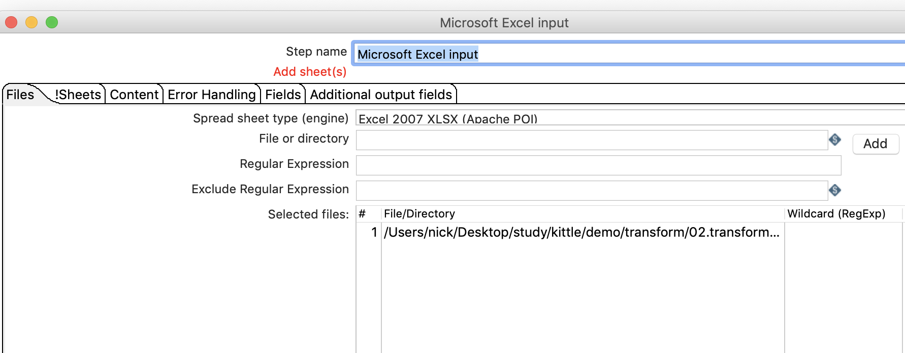
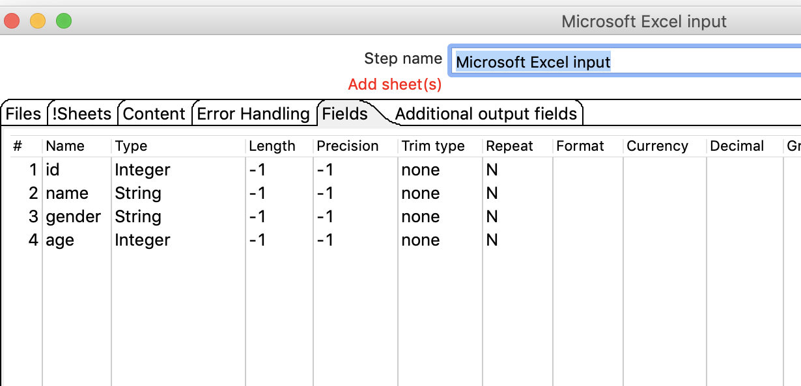
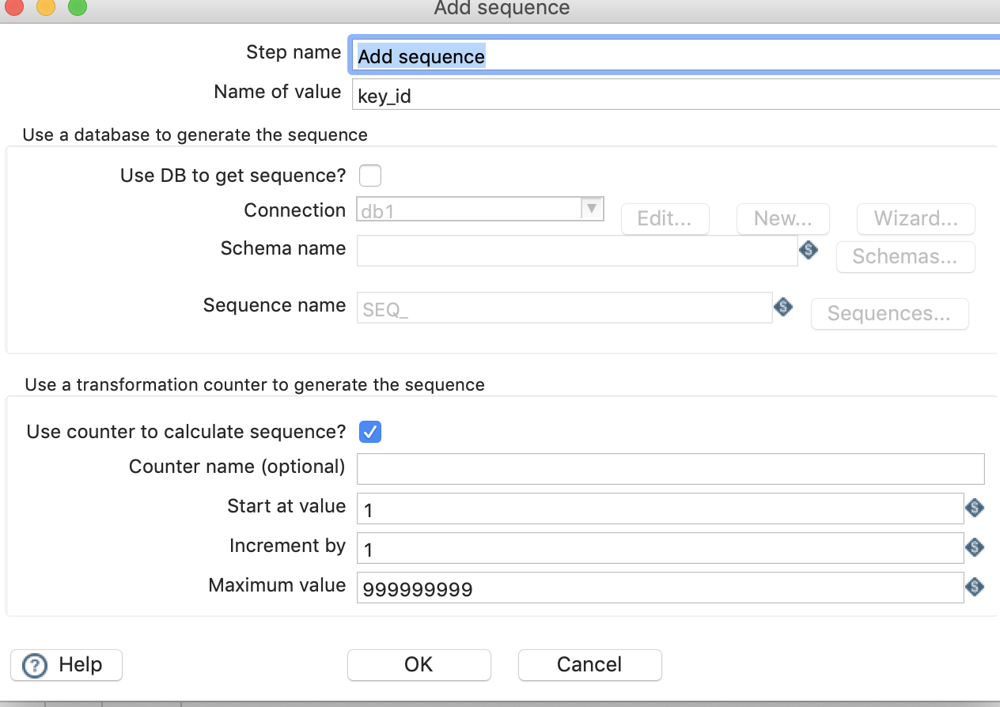
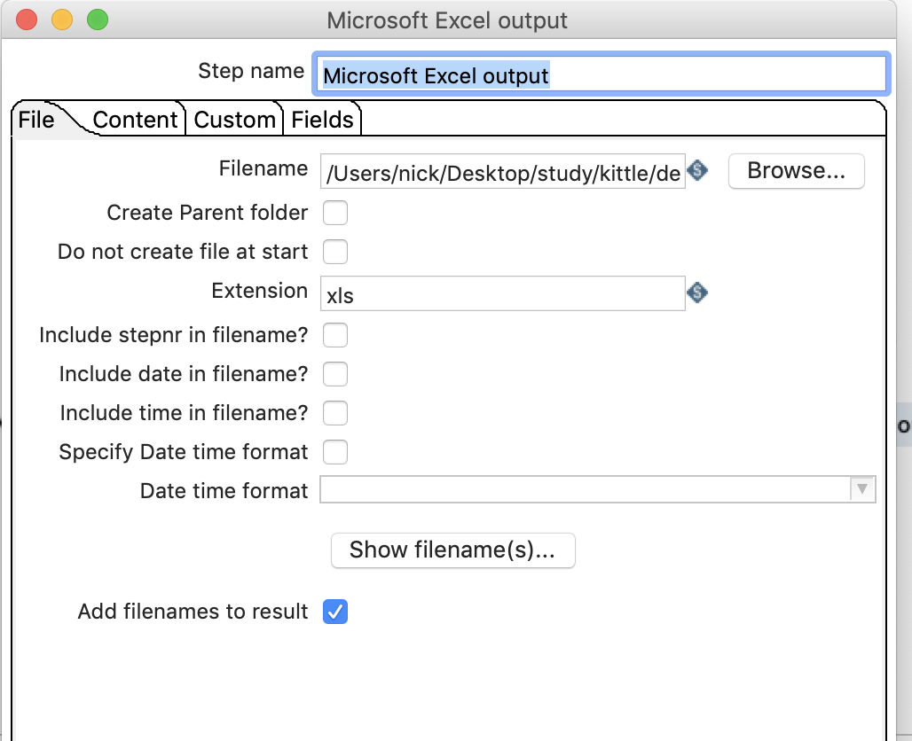
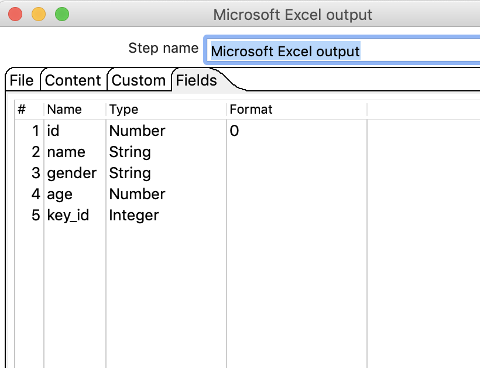
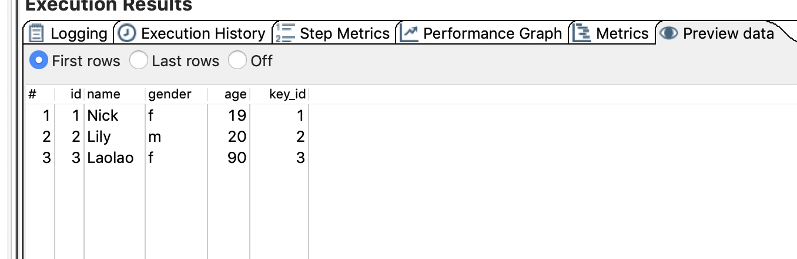

# 增加序列

## 案例介绍

给数据流里面添加一个序列字段。

从excel中读取数据，并添加序列，然后再保存到excel里面。

## 操作步骤

* 新建转换，添加excel输入，增加序列，增加excel输出，并连接  

  

* 配置excel输入   

  
  

* 配置序列  
  

* 配置excel输出   
 

   

* 执行查看效果，可以看到多了一列key_id，值从1开始递增     

