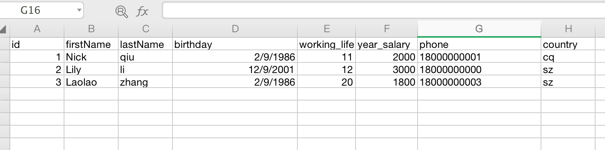
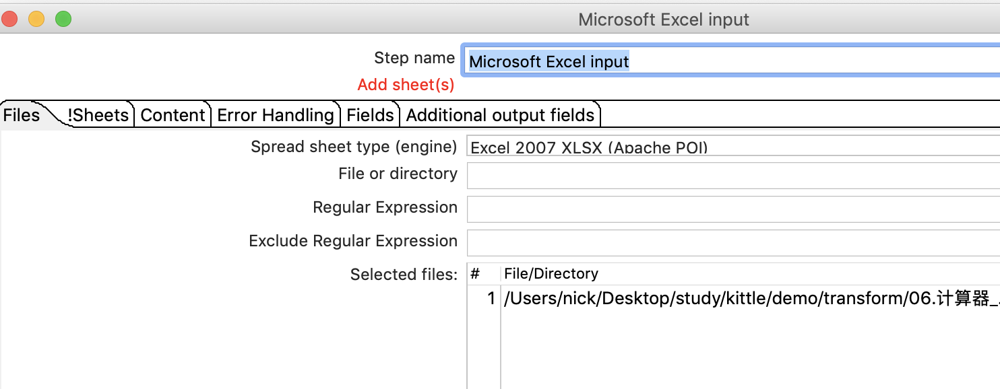
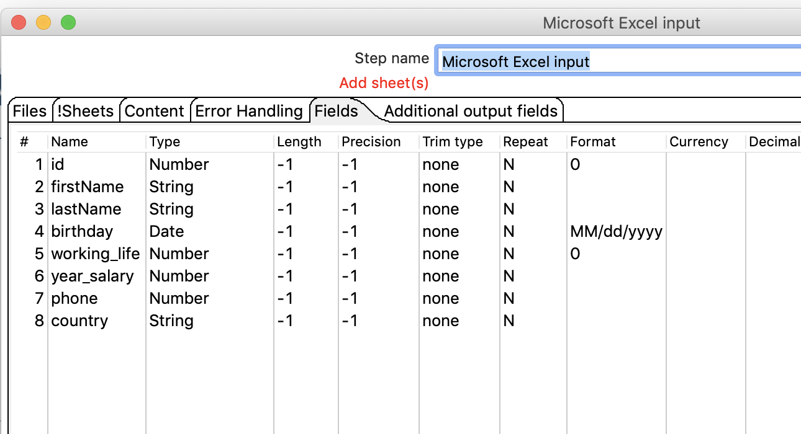
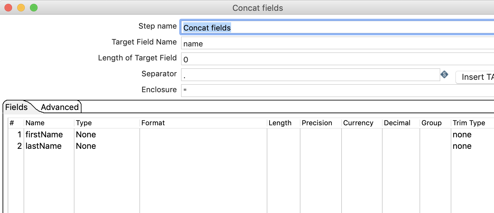
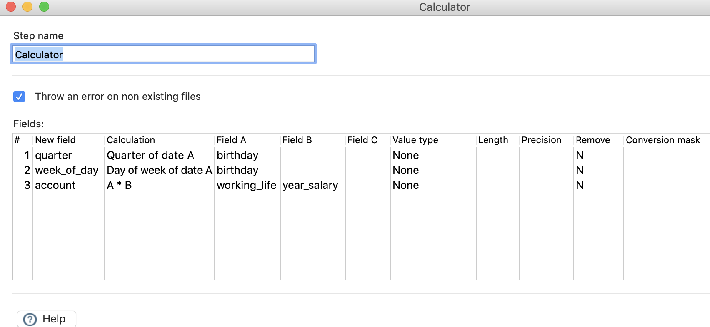
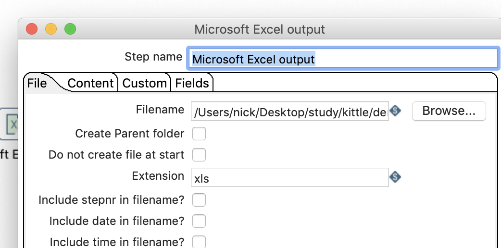
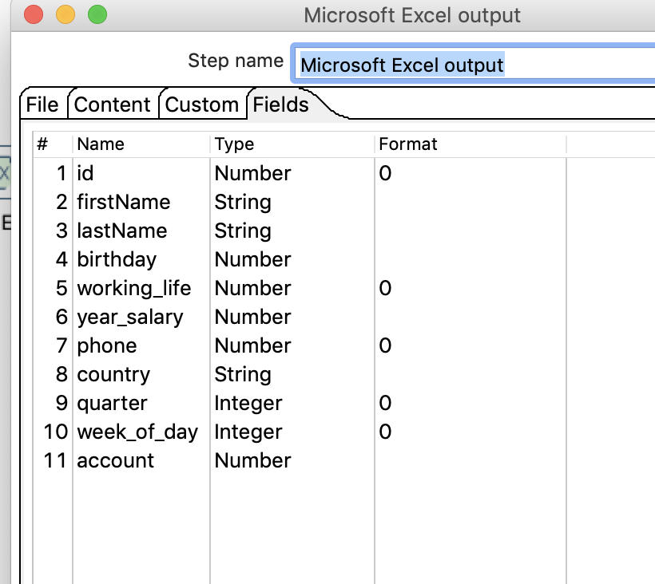
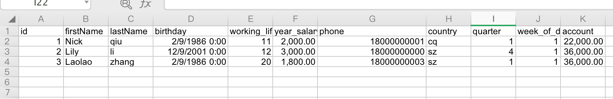

#  计算器

## 案例介绍

计算器是一个函数集合来创造新的字段，还可以设置字段是否移除计算前的字段（临时字段）

从excel中读取数据，生成name,quater,week_of_day,acount列，然后把输出数据存在excel中。

## 操作步骤 

* 输入数据  

  

* 新建转换，excel输入，concat filds，calcultor， excel 输出，并连接   

  

* 配置EXCEL输入   

    

* 配置连接   

  

*  配置计算器  

  

* 配置excel输出  
  
  

* 执行查看效果，输出文件如下    

