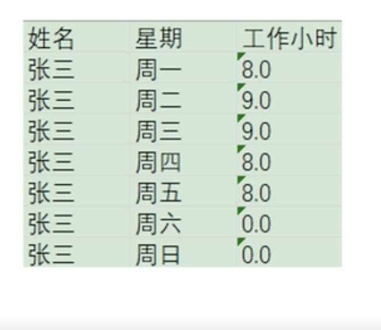
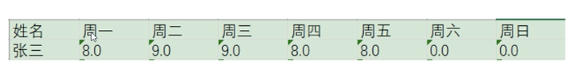
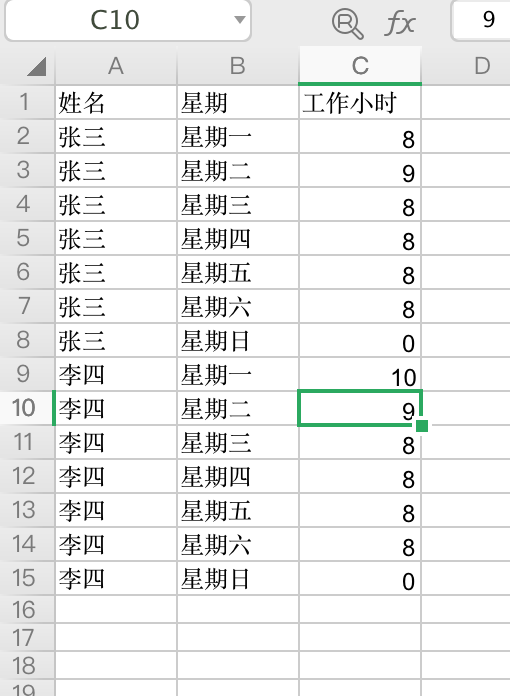
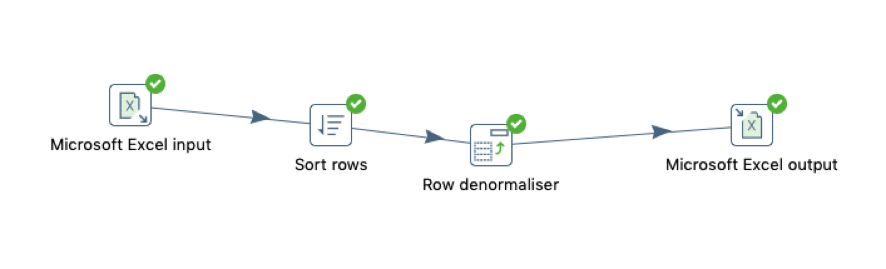
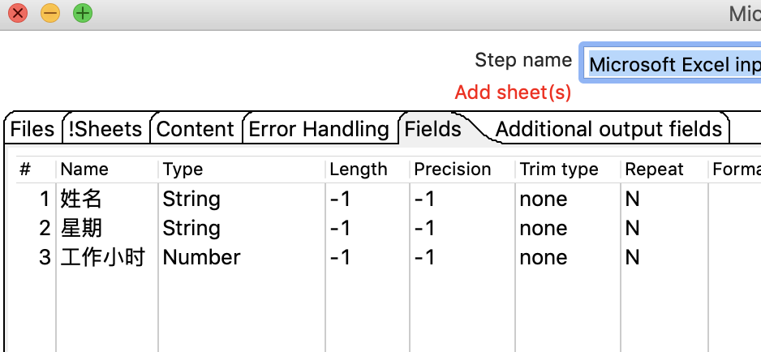
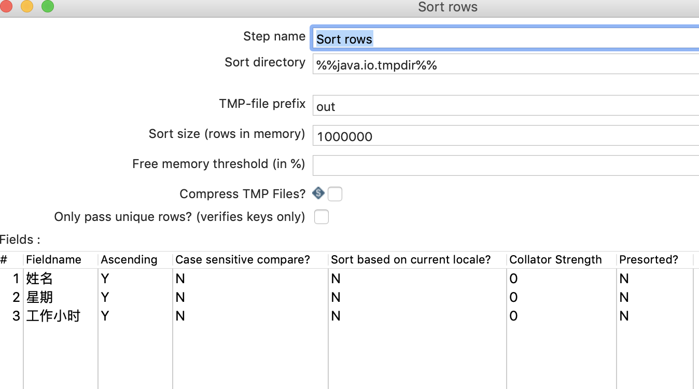
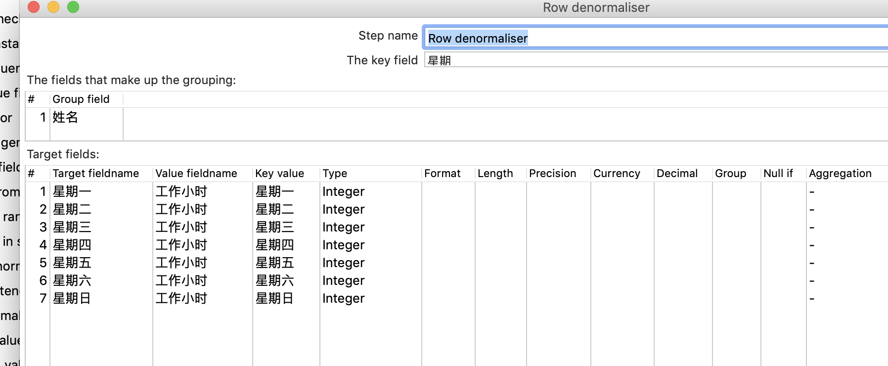
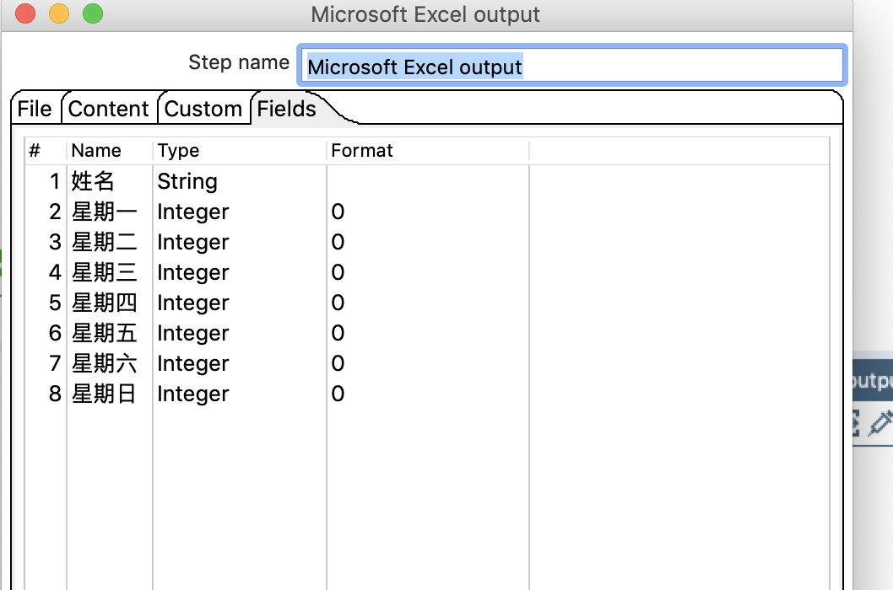
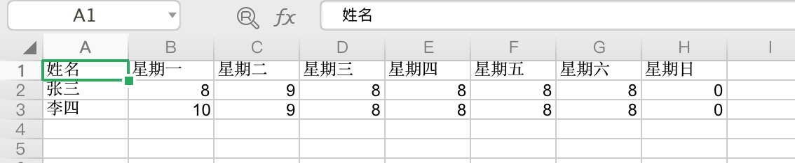

# 列转行

## 案例介绍

列转行就是**如果一列数据具有相同的值**，按照指定的字段，把多列数据转换成为一行数据。 去除一些原来的列名，把一列变为字段 。

* 如转换前： 
  
* 转换后： 

> 列传行之前需要对对应的数据流做排序处理。

从excel 中读取数据，按姓名进行分组，把星期、工作小时从列转为行，并存储到excel中 。

## 操作步骤 

* 输入excel数据 

  

* 新建转换，拖入excel输入、排序、列转行、excel输出，并连接  

 
* excel 输入  
 

* 排序  

* 列转行  

  

* excel 输出 
 

* 执行查看效果 

