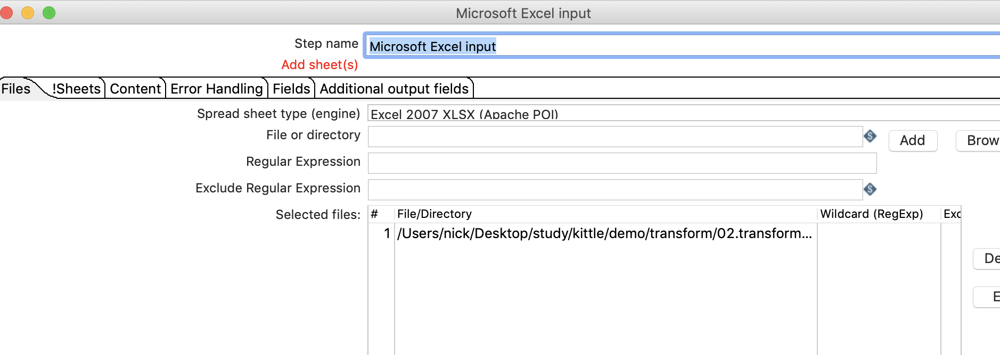
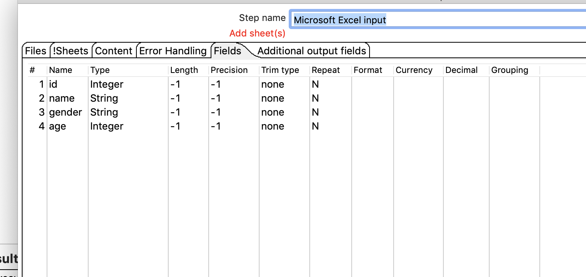
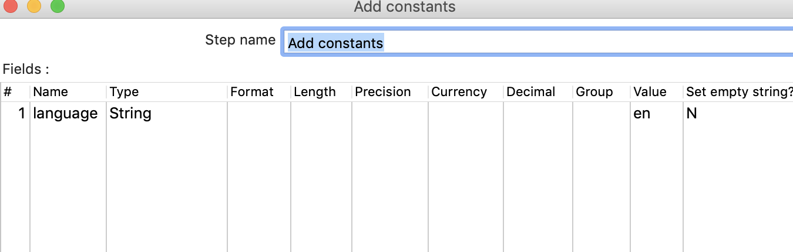
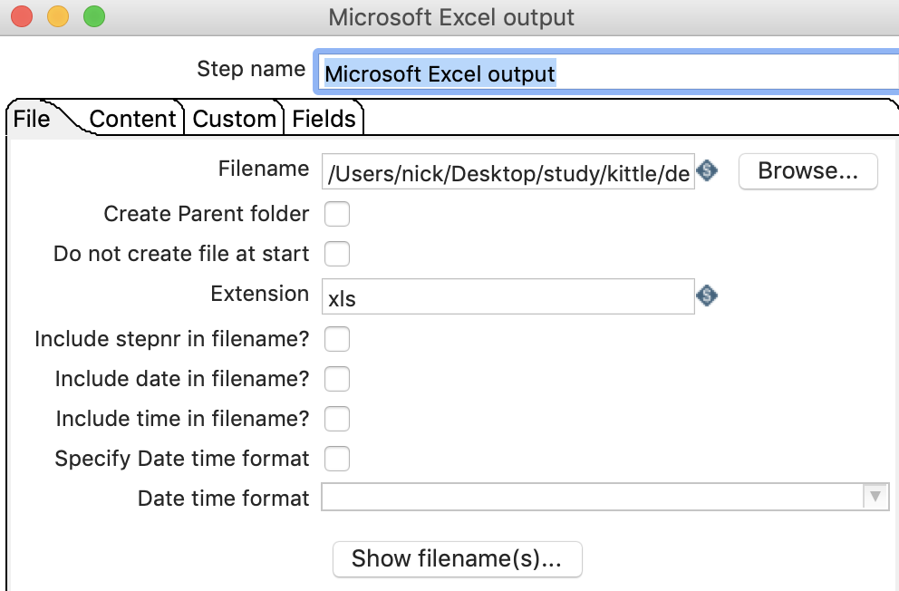
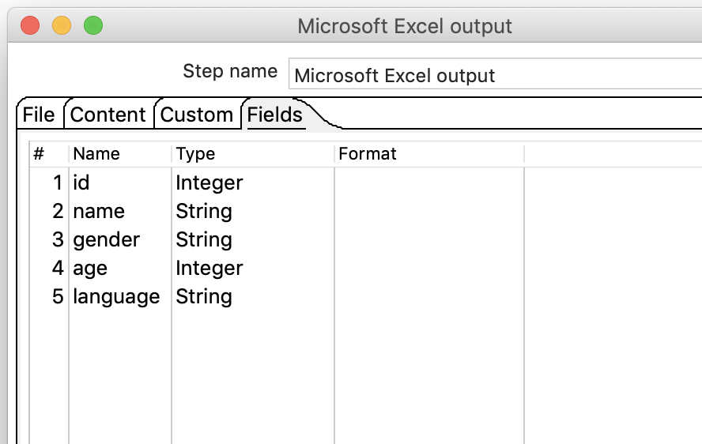
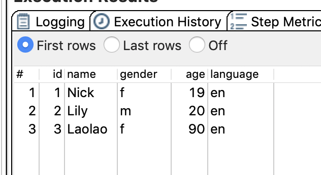

# 增加常量

## 案例介绍

在数据流中增加一列数据，值都相同 。  

从excel中读取数据，增加一列language值为en,把数据存储到excel中。

## 操作步骤  

* 创建转换，添加excel输入，excel输出，增加常量 ，并连接  

* 设置excel输入  
  
  

* 设置增加常量  

  

* 设置excel输出   

  

* 执行查看效果   

  
