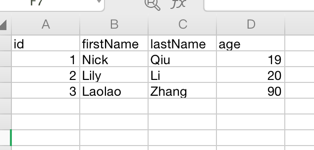
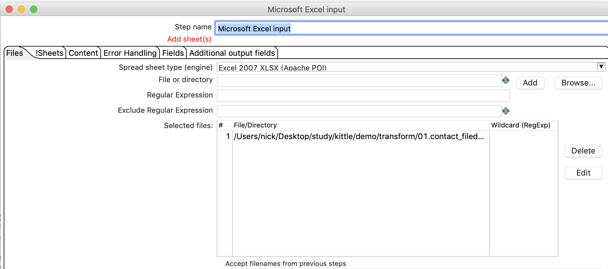
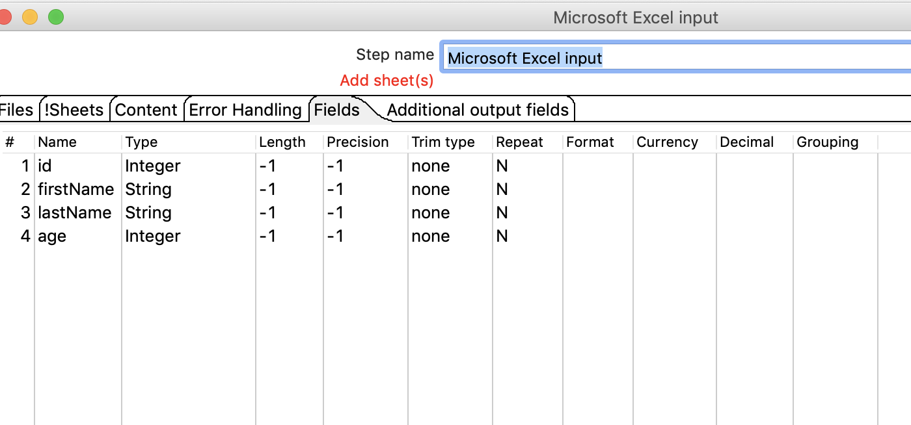
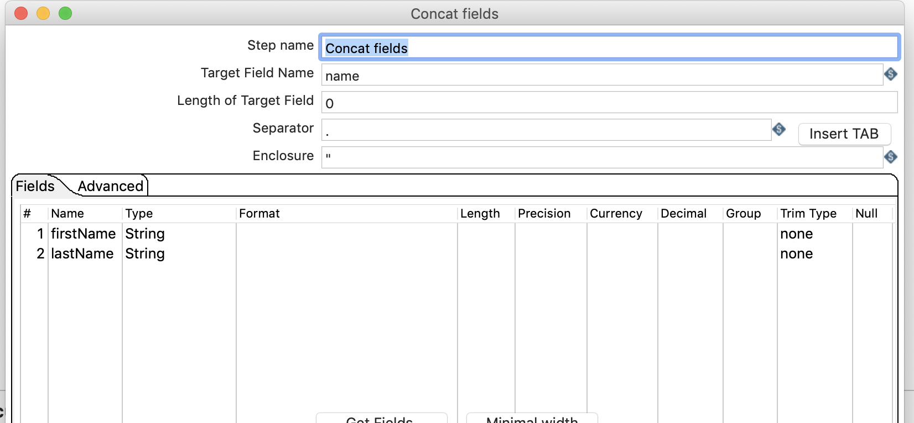
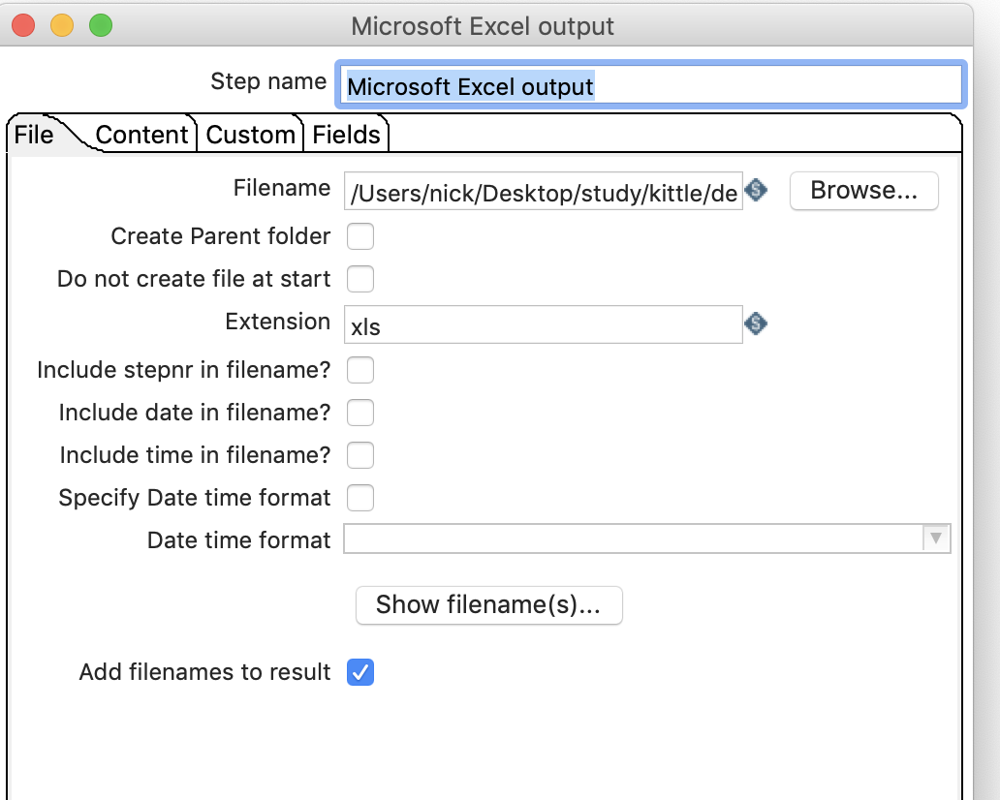
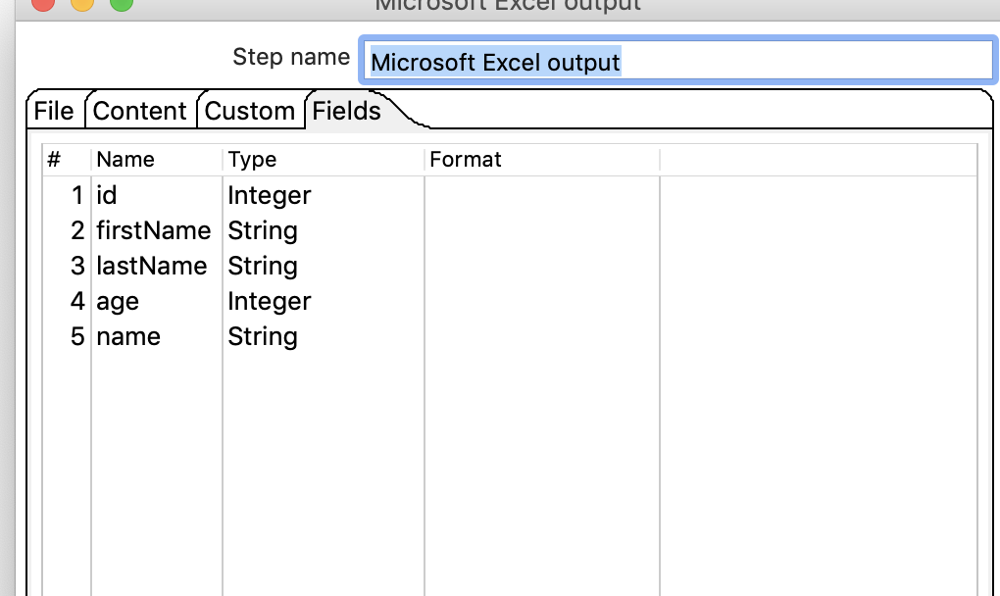
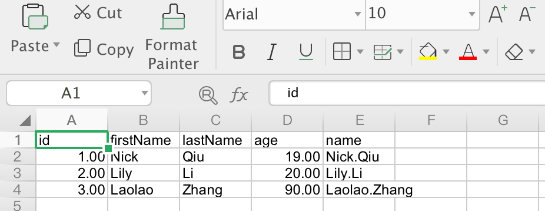

# contact fields

## 案例介绍

contact fields把多个字段连接起来作为一个新的记录

从excel中获取firstName和lastName连接起来，输出到excel中。

## 操作步骤 

* 原始数据EXCEL

* 新建转换，添加excel输入，excel输出contact fileds ,并连接起来。

* 设置excel输入 
  

* 设置contact fileds 

* 设置excel output (如果原来的firstName和lastName不显示，直接删掉即可)  
  

* 执行查看效果，可以看到多了一列name。  

