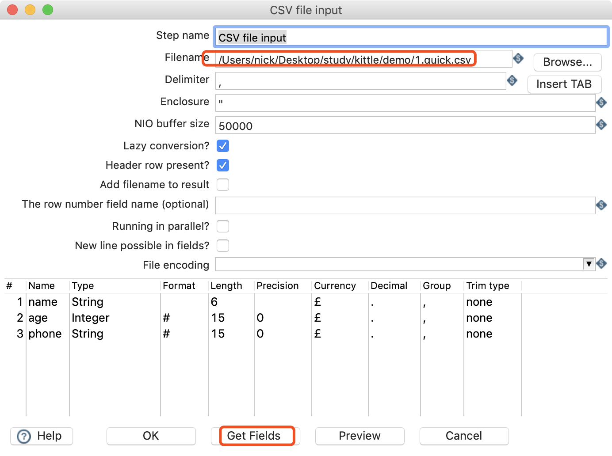
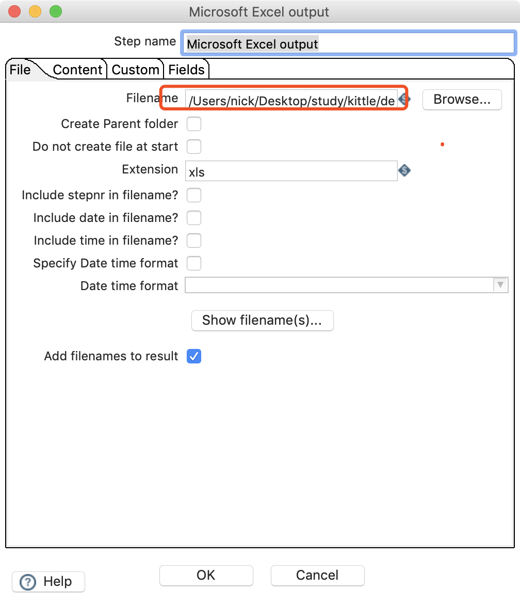
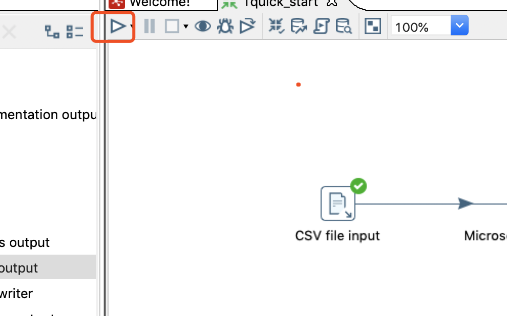
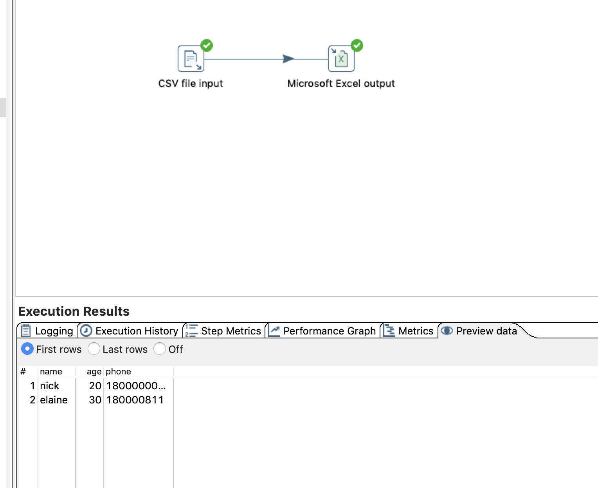

# CSV文件中读取数据写入EXCEL

## 案列介绍

存在一个CSV文件(1.quick.csv)内容如下： 
```
name, age, phone 
nick,20,18000000000
elaine,30,180000811
```

我们需要把该文件中的数据抽取，转存到EXCEL中去


## 操作步骤 

* 拖动input csv 和Microsoft Excel output到工作区
* 点击csv input选择文件，点击get fileds获取对应的列，配置类型




* 点击Microsoft Excel output    


* 设置输出文件名字  




* 点击运行图标执行程序




*  可在下方观察执行结果，也可以查看最终的输出文件  



## 注意事项

本文详细具体介绍了操作步骤，在后面的文章中，我们会省略如何运行和查看结果。


