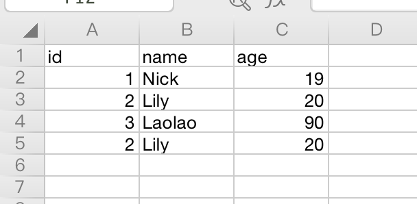
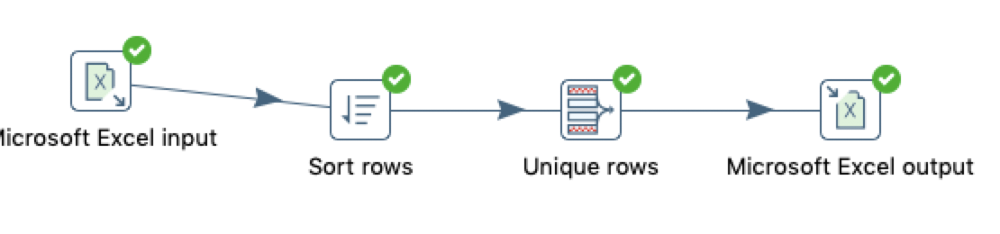
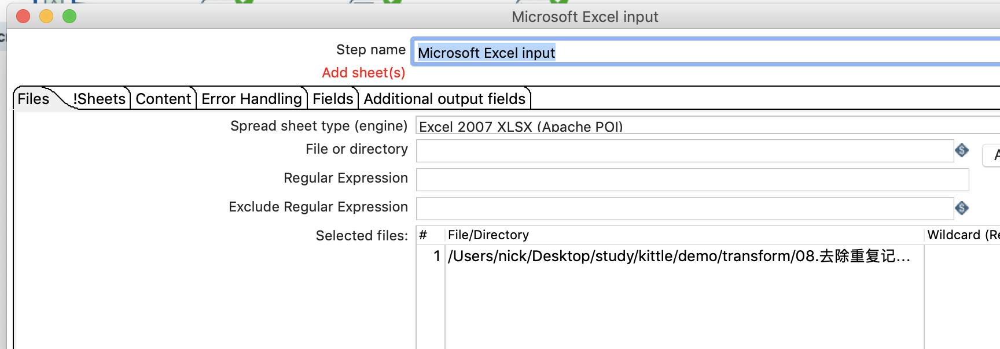
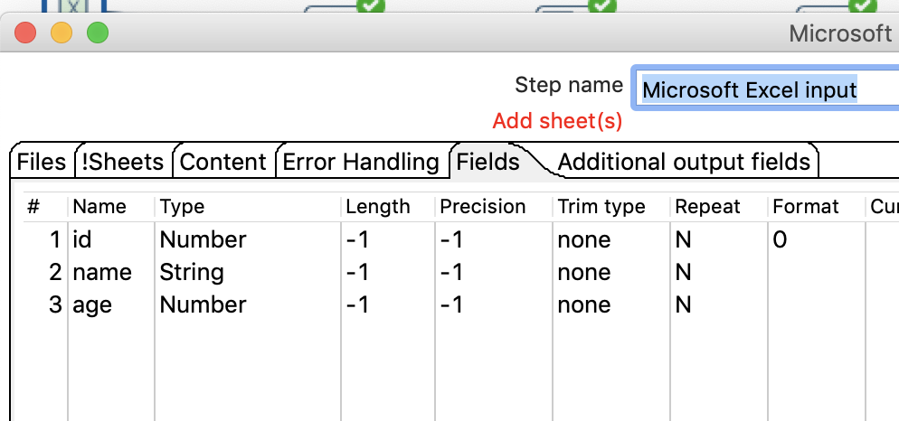
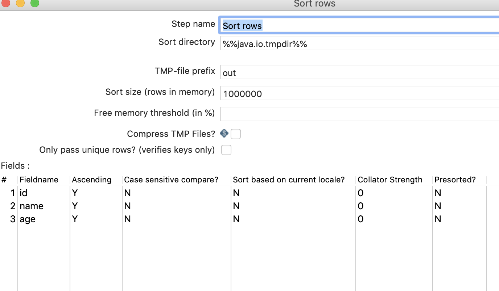
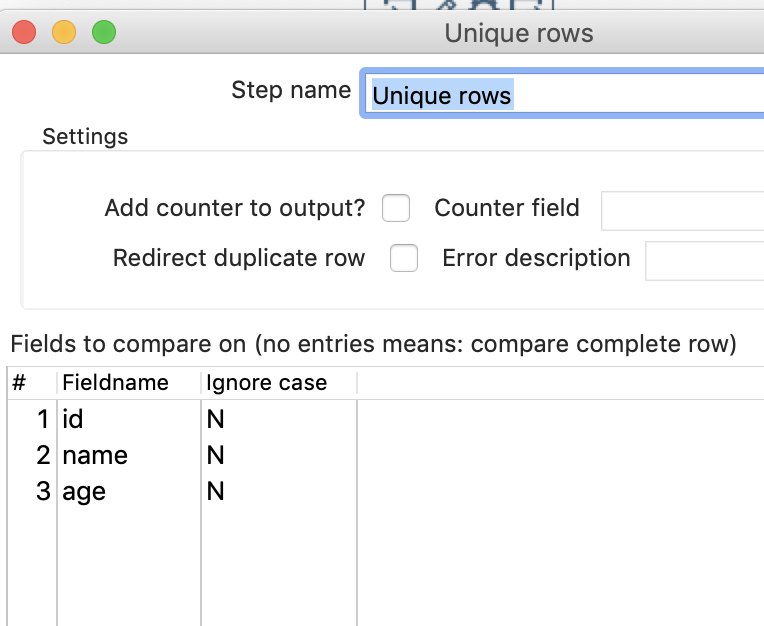
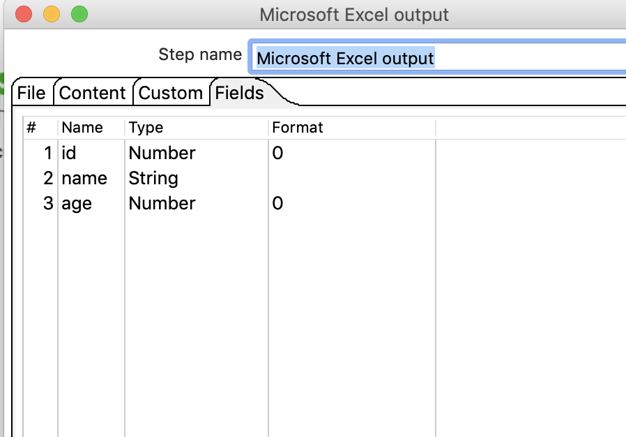
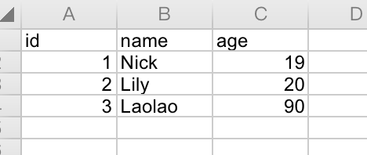

# 去重复、排序

## 案例介绍

* 去除重复记录，去除数据流里面的相同的数据行。（在使用之前需要先对数据进行排序）

在EXCEL中读取数据，去除重复的记录，并保存到excel当中去。

## 排序 

* 原始EXCEL数据  

* 新建转换，添加excel输入、排序、去除重复记录、excel输出，并连接起来；  

  

* 配置excel输入  

   

* 配置排序（对于去除重复记录空间，操作前，必须先进行排序）   

  

* 去除重复记录  
  

* excel输出   
   

* 执行查看效果，如下重复的一条数据被去掉了   

> tip： 切记去除重复记录之前要排序。  
