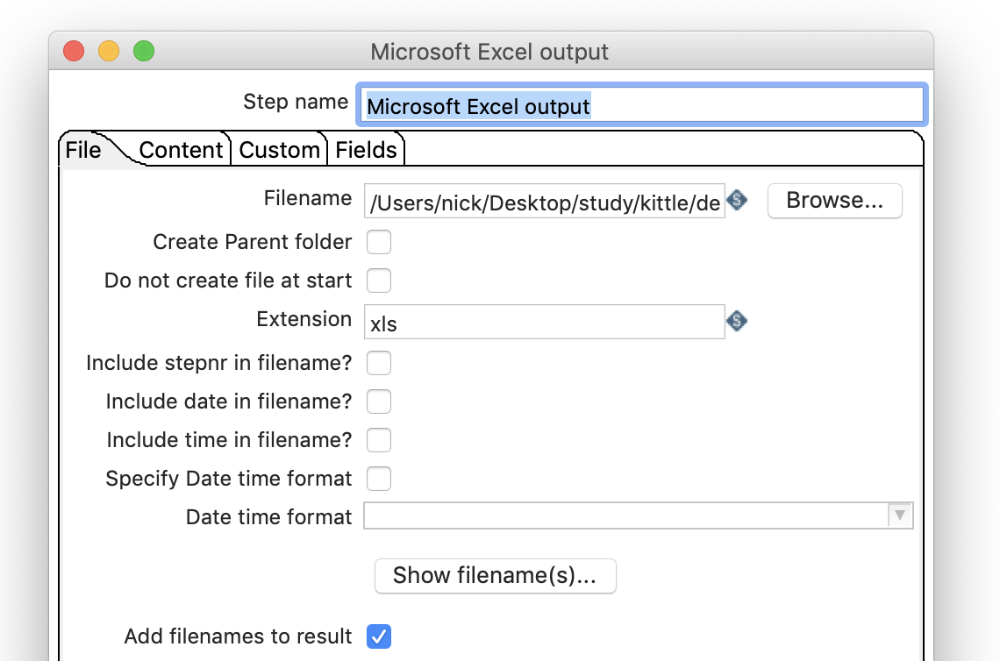
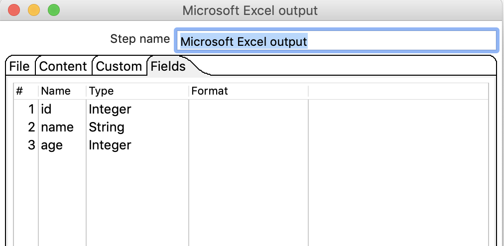
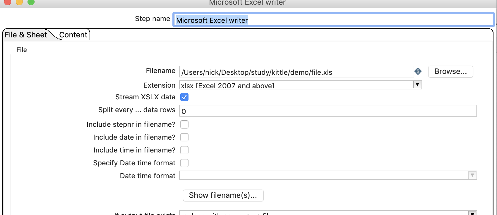
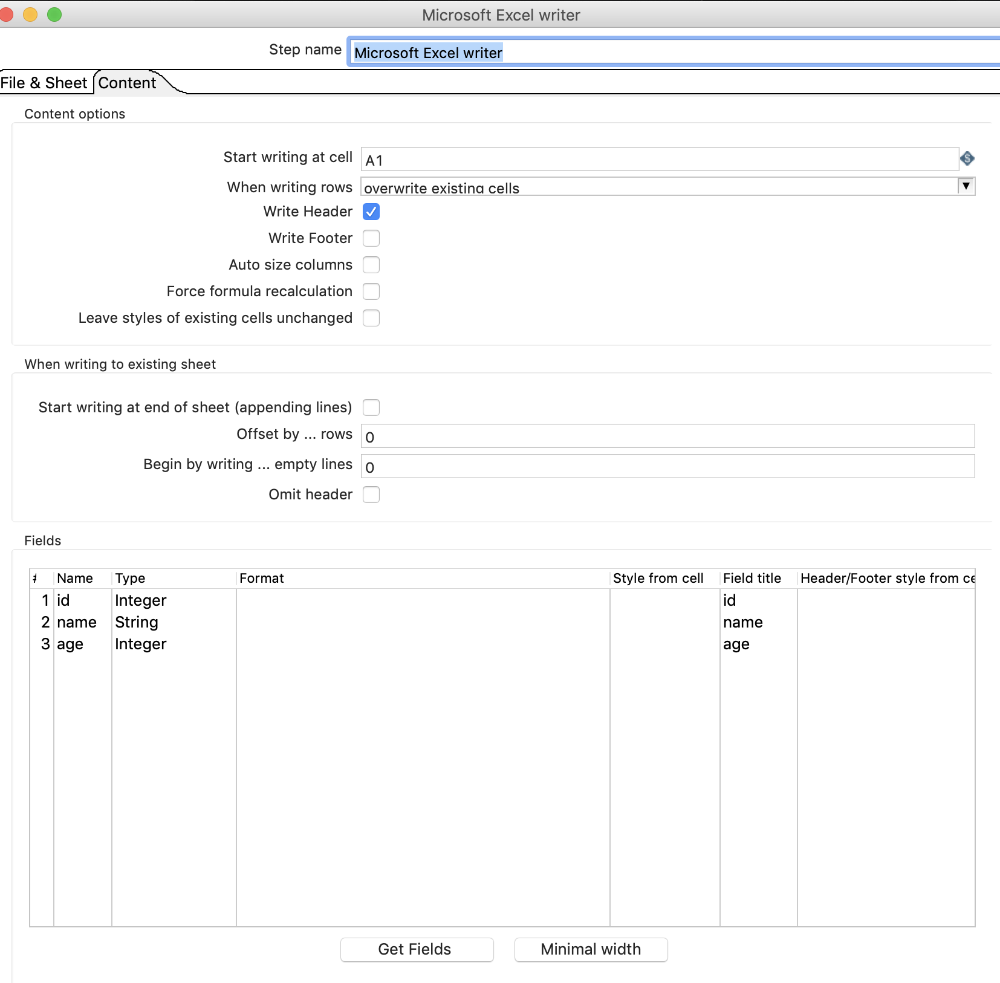
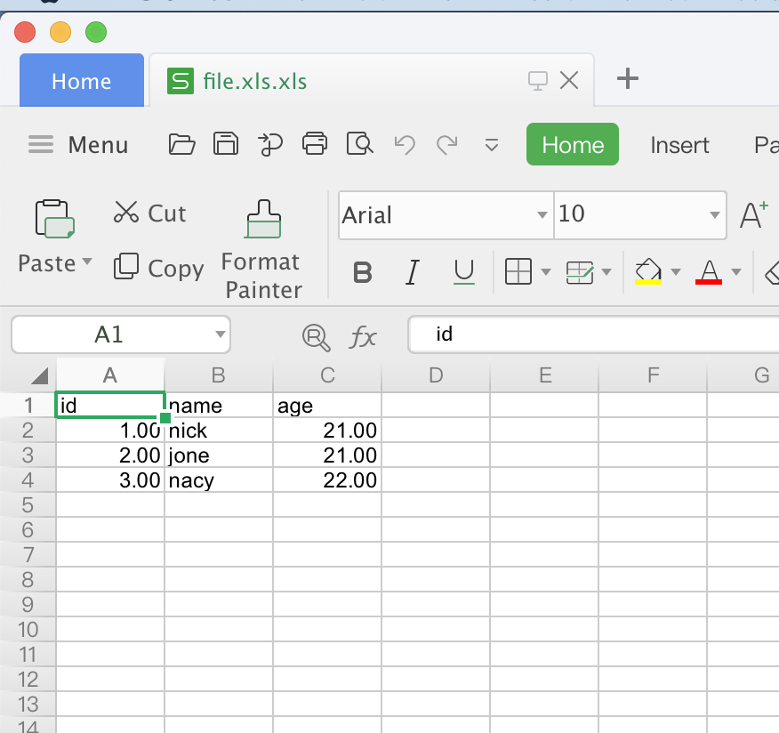
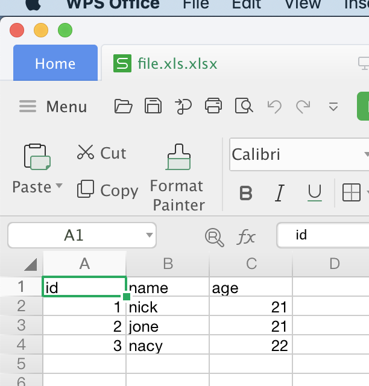

#  excel输出 

## 案列介绍

从MySQL数据库中读取user表，插入到excel文件.xls和xlsx中。


## 操作步骤

*  数据库准备  

```SQL
    DROP TABLE IF EXISTS `user`;

    CREATE TABLE `user`(
        `id` INT(11) NOT NULL AUTO_INCREMENT,
        `name` VARCHAR(20),
        `age` INT(3),
        PRIMARY KEY (`id`)
    );

    INSERT INTO `user` (`name`,`age`) VALUES('nick',21),('jone',21),('nacy',22);
```

* 创建表输入、excel output 和excel writer  （注： 连接第二个连线的时候选择复制）

 

* 配置表输入，参考[该文](table.md)

* 配置excel output 
  


* 配置excel writer 





* 执行检查效果  






