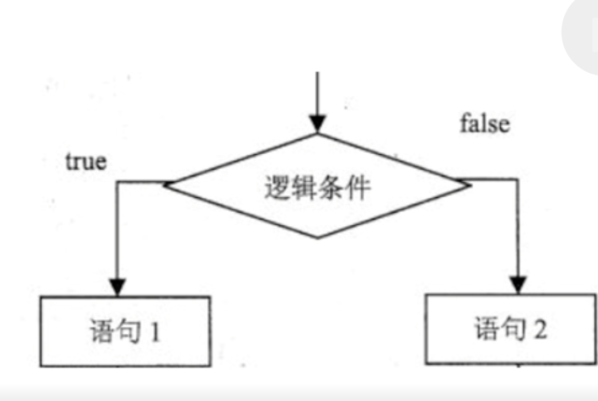
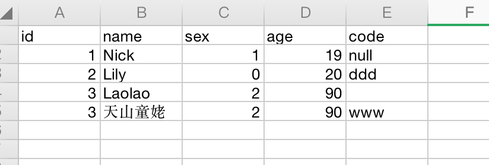
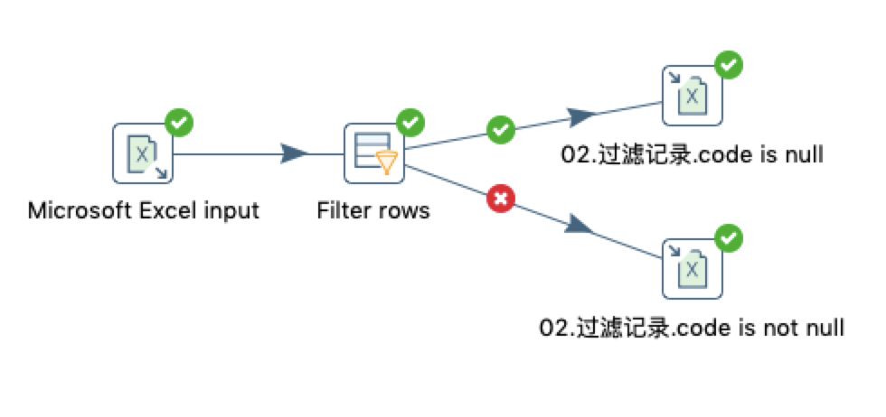
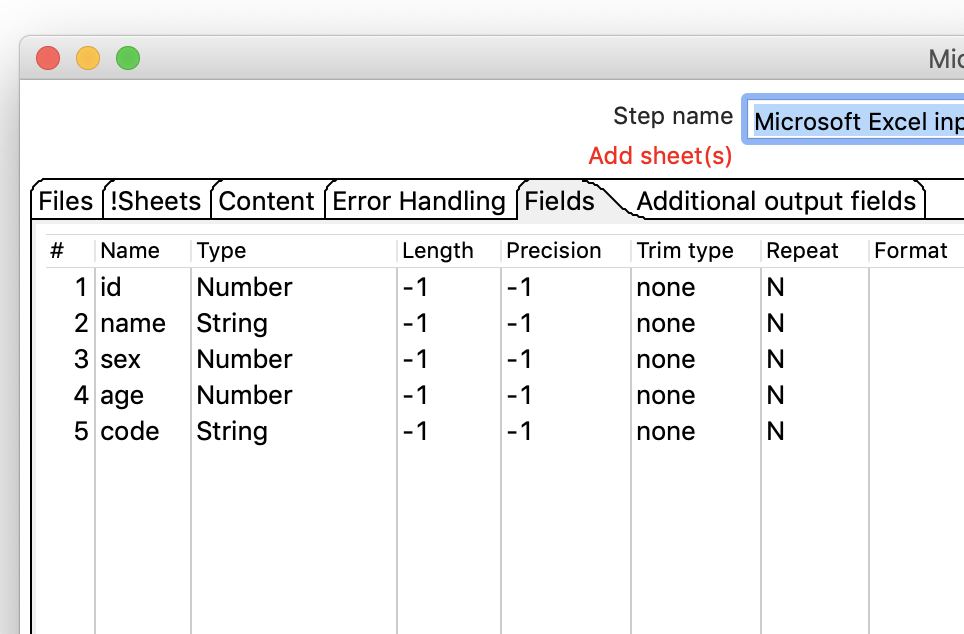
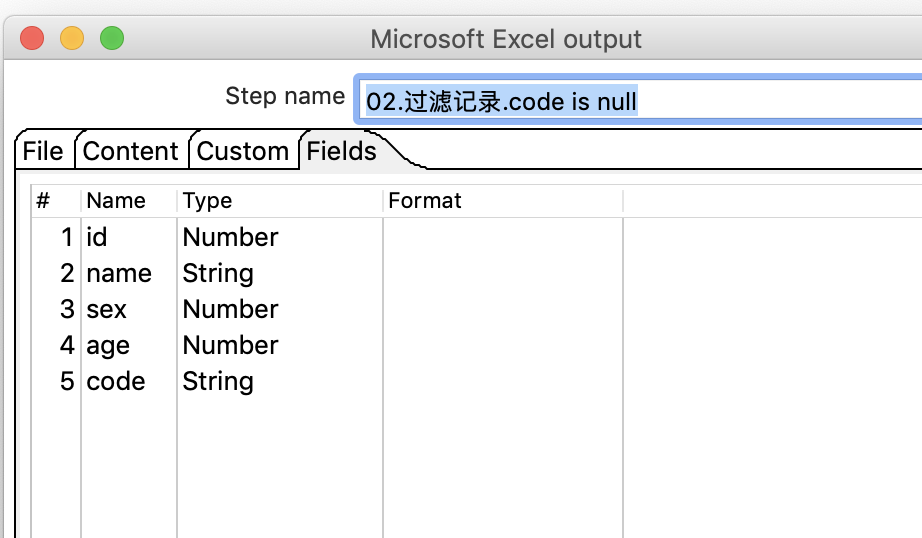
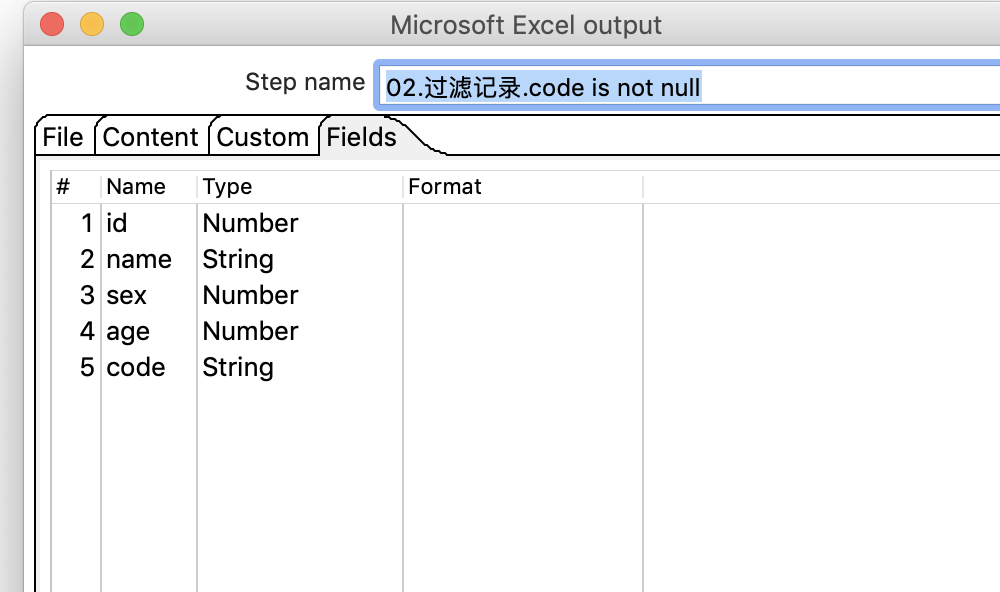
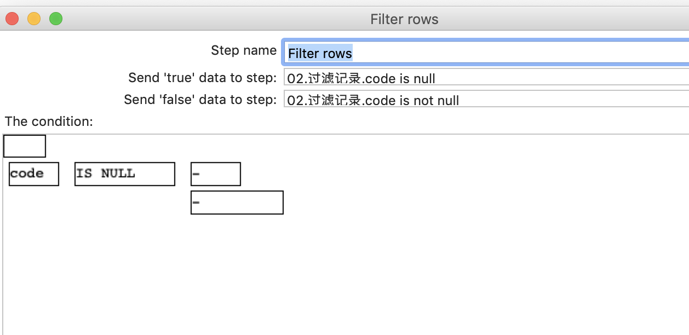
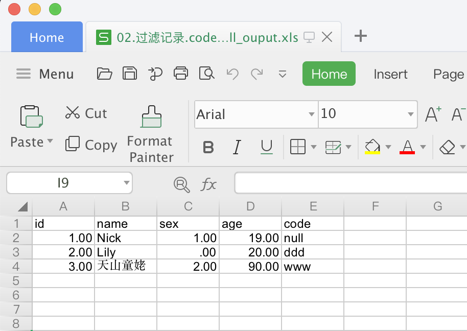
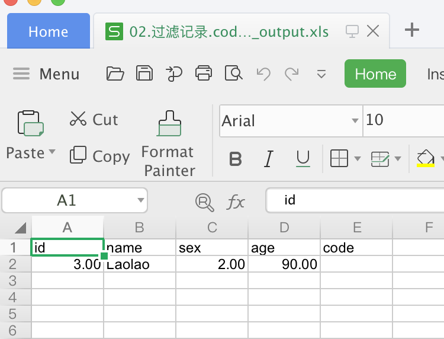

# 过滤记录

## 案例介绍

让数据流从一路到两路。  
  

从excel 中读取数据，分离出code列为空的数据，分别保存到不同的excel文件  

> 字符串NULL，不会被识别成为NULL

## 操作步骤

* EXCEL数据输入  

  

* 新建转换，引入excel输入，过滤记录，2个excel输出，并连接 

  

* excel 输入 
  

* 2个excel输出   
  

* 过滤记录 

  

* 执行查看效果   

  

