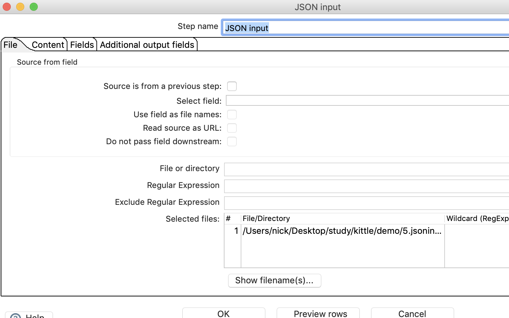

# json输入

##  案例介绍

有一个json文件，在json文件中提取数据，存储到excel中去。


## 操作步骤

* json 文件如下  
```json
{
    "status": "ok",
    "response": {
        "submissions":[
            {
                "id": "566777",
                "timestamp": "2011-11-12 12:12:12",
                "user_agent": "Mozilla/5.0 (Windows NT 6.1; WOW; rv:8.0)",
                "remote_addr": "192.1678.1.1",
                "payment_status": "",
                "data":[
                    {
                        "field": "112233",
                        "value": "Nick"
                    },
                    {
                        "field": "1111",
                        "value": "CHF"
                    },
                    {
                        "field": "444",
                        "value": "Jone"
                    }                ]
            }
        ]
    }
}
```

* json文件经过两步处理获得id、field、和value  


* json input 1 ,注意path的设置

  


* json input 2  

  


* EXCEL 输出


* 执行查看效果  


## 补充知识

* JSON的核心概念

  * 数组： []
  * 对象： {}
  * 属性： key: value

* JSONPath，点记法 

|符号|说明|
|--|--|
|$|查询根节点对象，用于表示一个JSON数据，可以是数组或者对象|
|@|过滤断言处理当前节点对象，类似于JAVA中的THIS|
|*|通配符，可以表示一个名字或数字|
|..|可以理解为递归搜索，deep scan, avaliable anywhere a name is required.|
|.name|表示一个子节点|
|['\<name>'(,'\<name>')]|表示一个或者多个子节点|
|[\<number>(,\<number>)]|表示一个或者多个数组下标|
|[start:end]|数组片段，区间为[start,end)|
|[?(\<expression>)]|过滤表达式表示结果必须为true|


