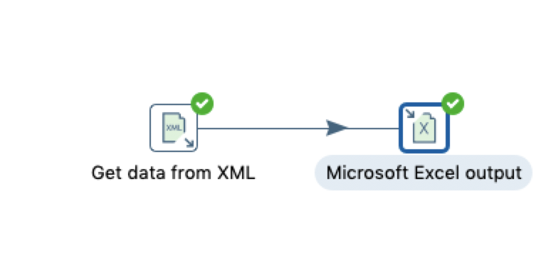
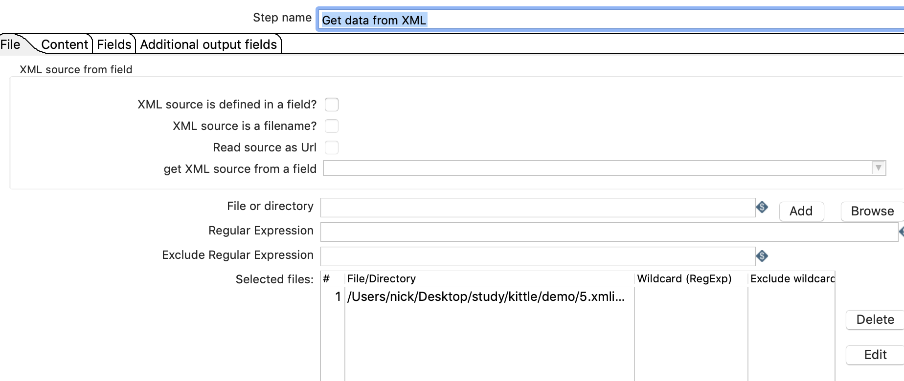
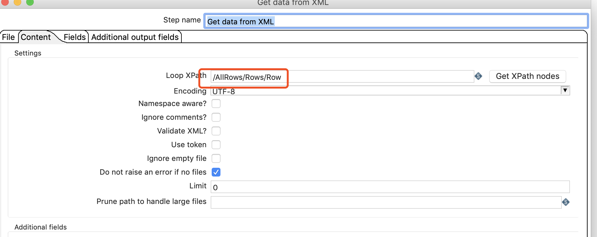
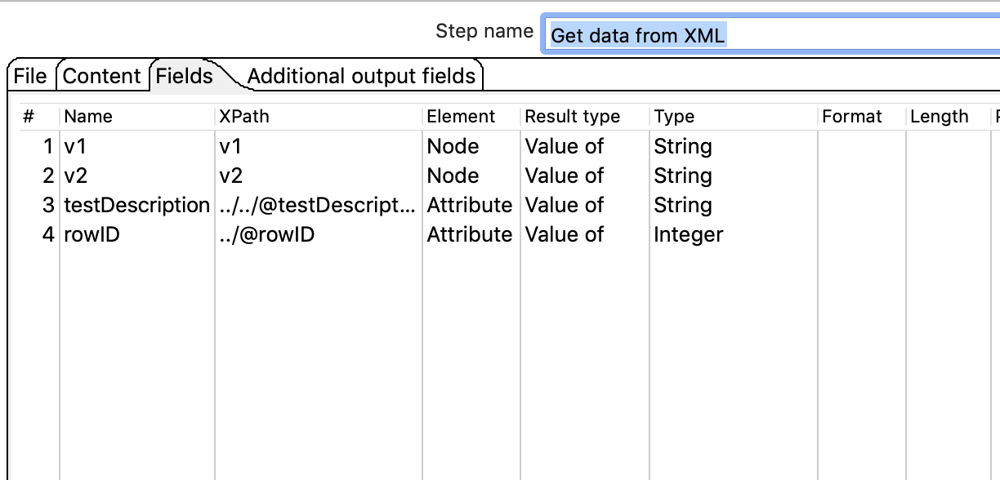
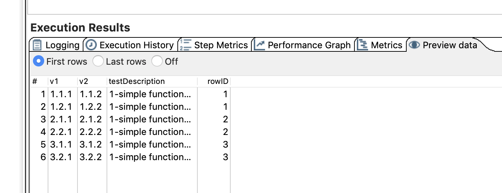
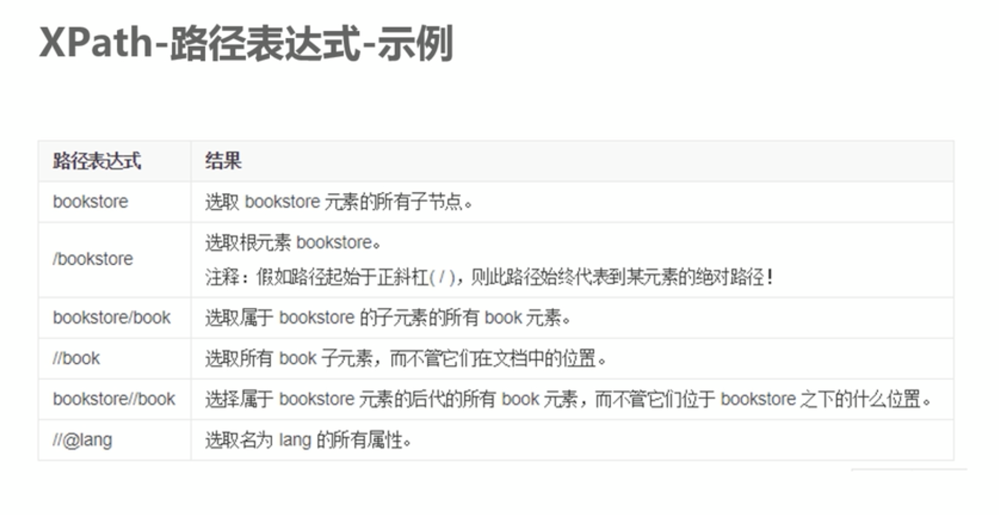

#  xmL输入


## 案例介绍

从XML文件中读取数据，转换到EXCEL中。

## 操作步骤 

* XML文件  

```XML
<?xml version="1.0" encoding="UTF-8" ?>
<AllRows testDescription="1-simple function test">
    <Rows rowID="1">first row chunk of data 
        <Row><v1>1.1.1</v1> <v2>1.1.2</v2> </Row>
        <Row><v1>1.2.1</v1> <v2>1.2.2</v2> </Row>
    </Rows> 
    <Rows rowID="2">second row chunk of data 
        <Row><v1>2.1.1</v1> <v2>2.1.2</v2> </Row>
        <Row><v1>2.2.1</v1> <v2>2.2.2</v2> </Row>
    </Rows> 
    <Rows rowID="3">third row chunk of data 
        <Row><v1>3.1.1</v1> <v2>3.1.2</v2> </Row>
        <Row><v1>3.2.1</v1> <v2>3.2.2</v2> </Row>
    </Rows> 
</AllRows>
```


* input选择get data from xml,output 选择excel,并连接



* 配置INPUT 选择文件  


* 配置INPUT，配置列根节点 



* 配置filds，这里特别留意XPATH的值决定了我们能够获取到什么。




* 执行验证输出 



## 补充知识 XPATH

xpath是xml路径语言，他是一种定位XML文档中某一位置的语言

xpath是基于XML的树状结构，提供在树形结构中寻找节点的能力。 


|表达式|描述|
|--|--|
|nodename|选取该节点的所有子节点 |
|/|从根节点选取
|//|匹配选择的当前节点选择文档中的节点，而不考虑它们的位置|
|.|选取当前节点|
|..|选取当前节点的父亲节点|
|@|选择属性|


