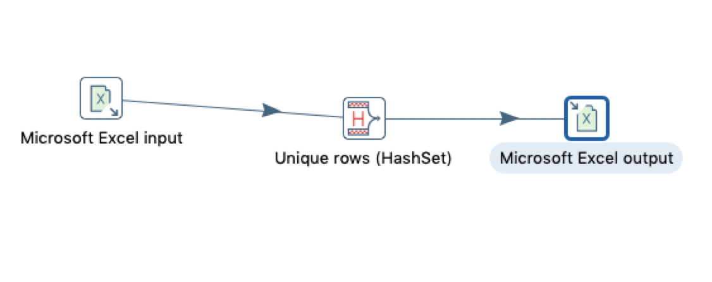

# 唯一行(哈希值)

## 案例介绍

唯一行hash值，就是删除数据流中重复的行。  
和排序+去除重复记录类似，但实现原理不同，该方法效率会高一些。

从excel中读取数据，去除重复的字段，并保存到excel。

## 操作步骤 

* 原始excel数据 

 

* 新建转换,添加excel输入，唯一行hash值,excel输出 ，并连接  

* excel 输入 
  
  

* 唯一行hash  
  

* excel 输出  
 

* 执行查看效果，可以看到重复的记录被去除除掉并写入excel中。  

  

