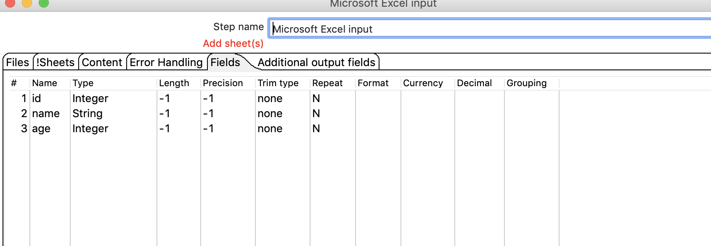

#  插入更新

## 案列介绍 

插入更新和更新有一定区别，对于插入更新来说如果数据不存在则插入数据，如果存在在更新数据。

从excel中读取id，name，age字段，并插入更新到数据库表中。

## 操作步骤  

* 新建转换，拖入excel输入，和插入更新，并连接 

* 设置EXCEL输入  
  

* 设置插入更新

* 执行查看效果，可以看到数据库中多插入了一条数据  

