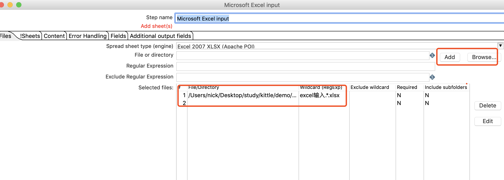
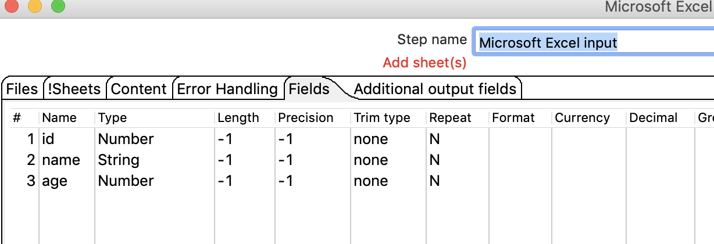
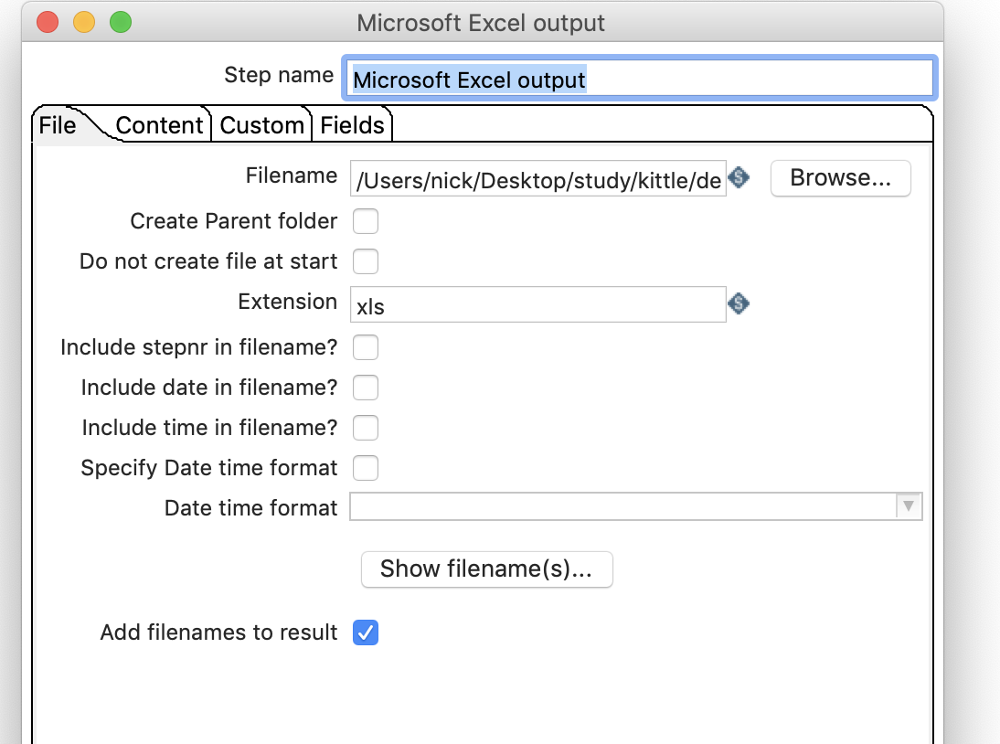
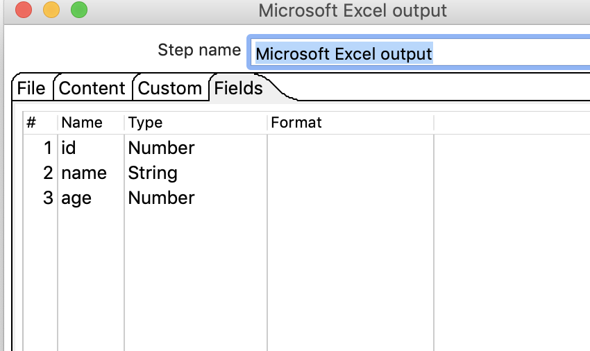
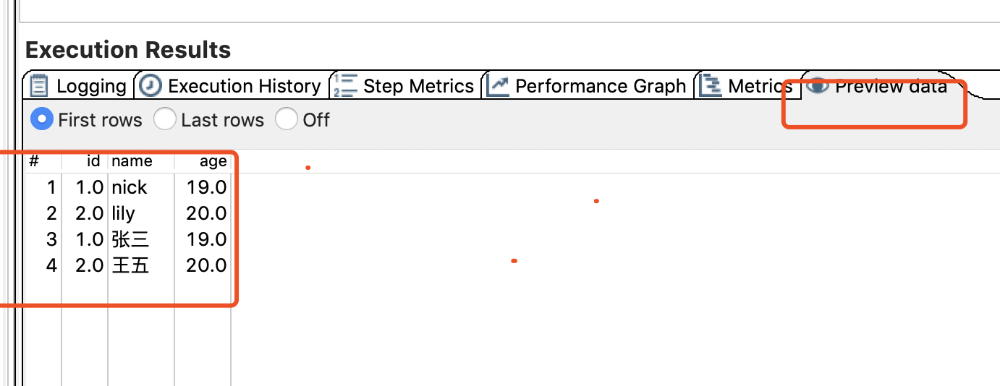

#  多文件合并

## 案例介绍

多文件做为数据源，合并成为一个数据。 

本例中我们把2个数据结构一样的数据源合并，然后再输出到EXCEL中去。 

## 操作步骤

*  excel 输入，excel输出，并连接

* 设置EXCEL 输入，选择文件夹，并且使用通配符匹配文件夹下的多个文件 

* 设置excel输入，配置filds 

* 配置输出文件以及filds  

  

*  运行检查输出  

