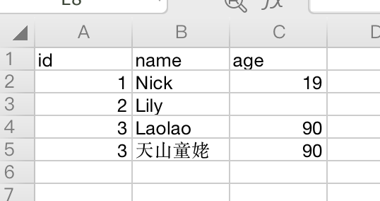
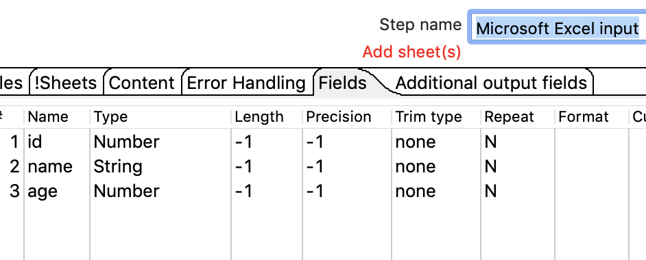
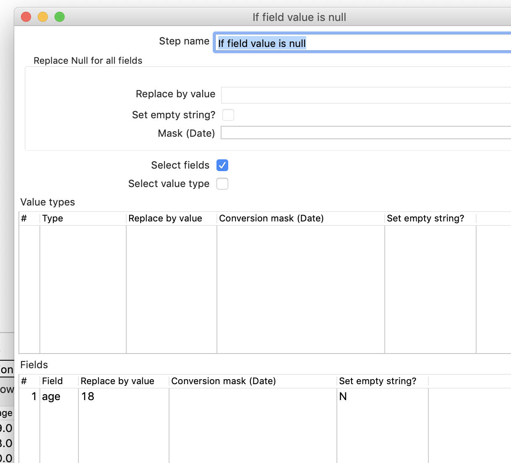
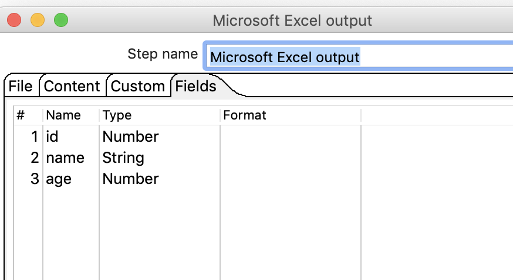
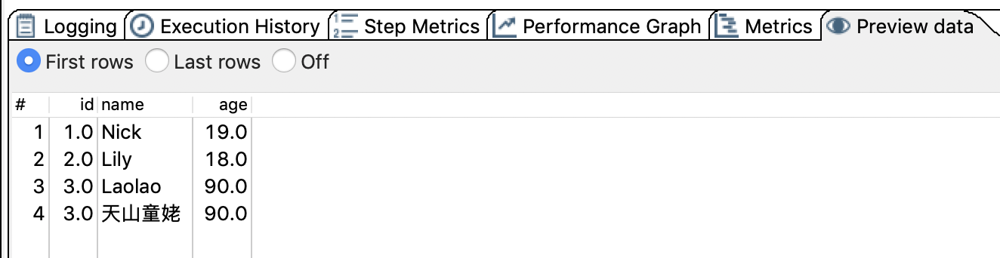

# 替换空值

## 案例介绍

替换空值就是把Null转换成为其他的值。

可以替换所有的空值，也可以只替换指定字段的空值。

## 操作步骤

* excel 数据输入  

  

* 新建转换，引入excel输入，应用里面的替换空值,excel输出 

* excel 输入 

  

* 指定age字段为空替换成为18  

* excel输出 

  

* 执行查看结果 

