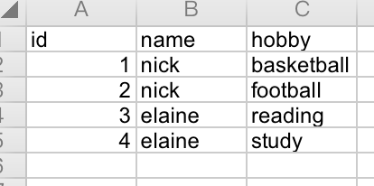
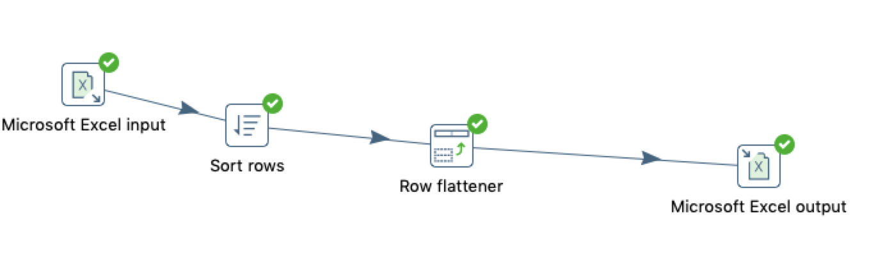
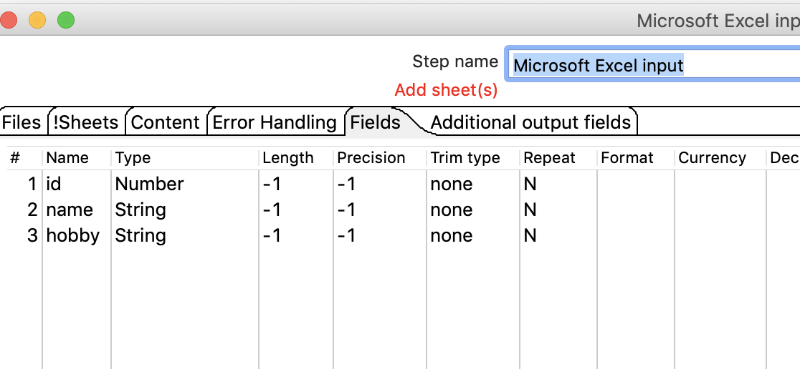
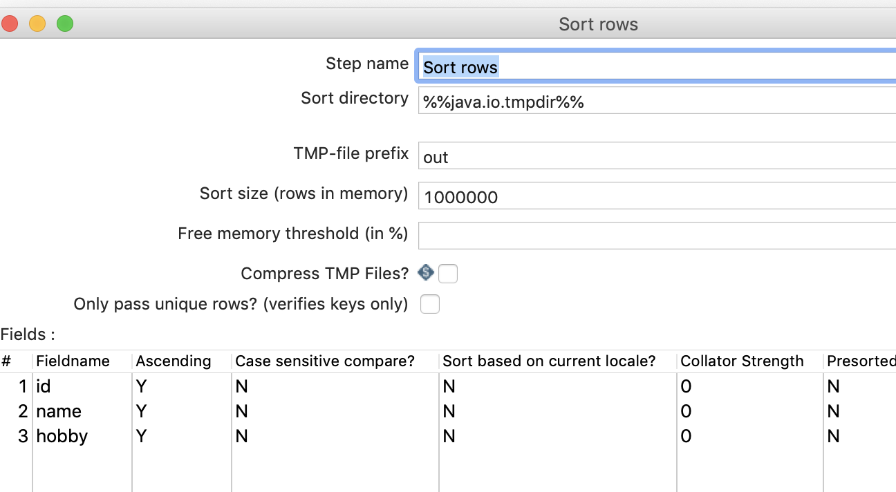
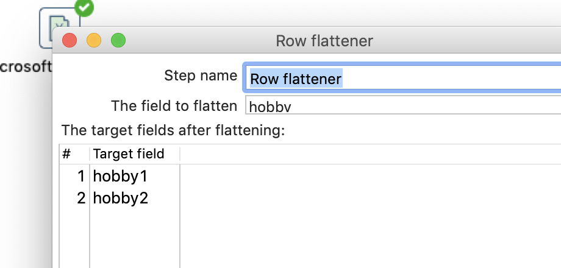
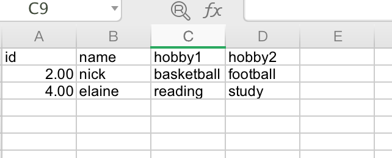

# 行扁平化

## 案列说明 

行扁平化就是把同一组数据的多行数据合并成一行 。

注意： 
只有数据流的同类数据记录一致的情况才可以使用！  
数据流必须进行排序，否则结果不正确；

从excel读取数据，把数据 进行扁平化处理，存储excel 。

## 操作步骤

* 原始excel数据  

* 新建转换，添加excel输入、排序、行扁平化、excel输出，并连接： 
  

* excel输入  
 

* 排序    
  

* 行扁平化

 

* excel输出  
  

* 执行查看效果 

  

