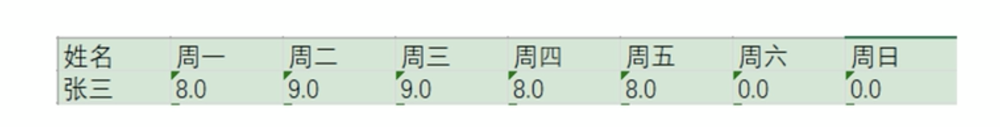
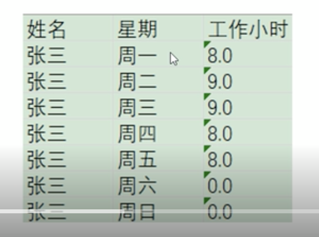
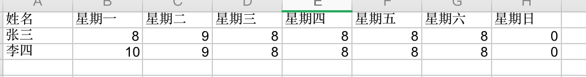
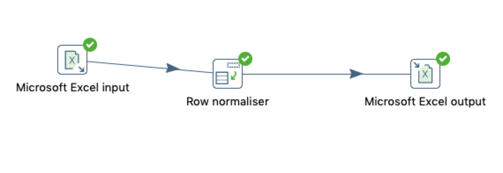
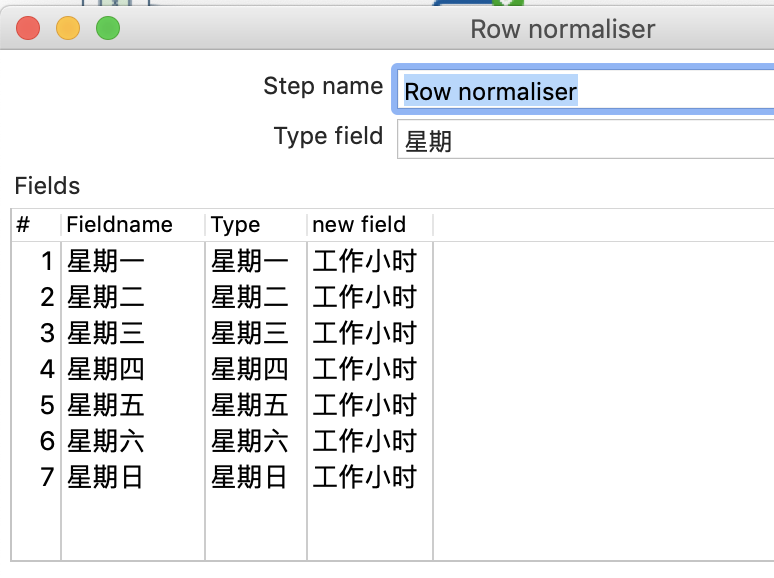
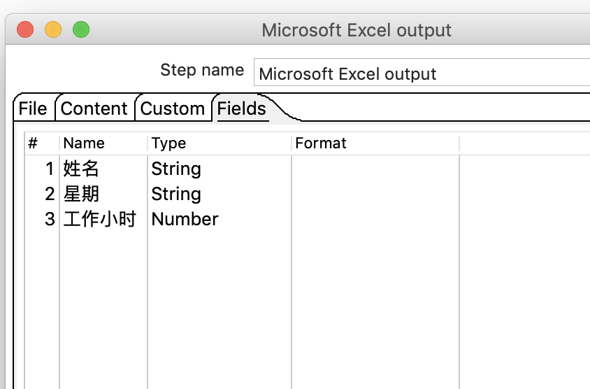
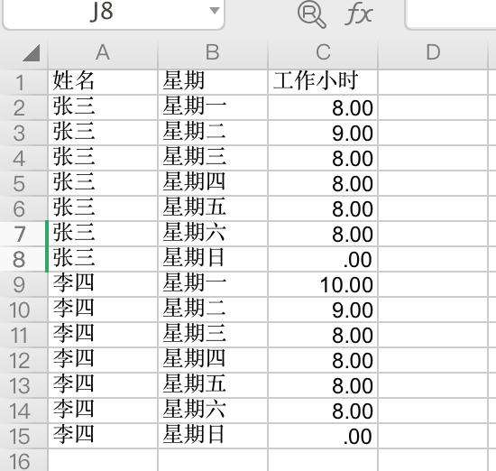

# 行转列

## 案列介绍

* 把数据字段的字段名转换成为一列，把数据行变成数据列,如：  

从excel中读取数据，把星期工作小时行，转换成为星期列和工作小时列，把数据保存到excel中。

## 操作步骤

* excel原始数据  
 

* 新建转换，拖入，excel输入、行转列、excel输出 

* excel 输入  
 

* 行转列  
  

* excel输出 
 

* 执行查看效果 

   
