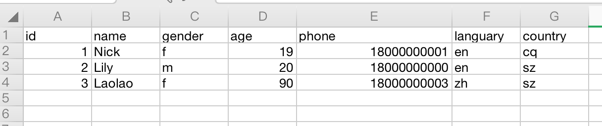
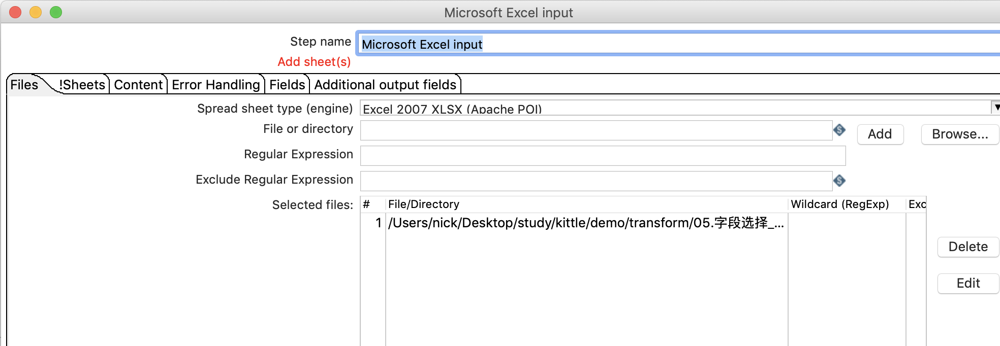
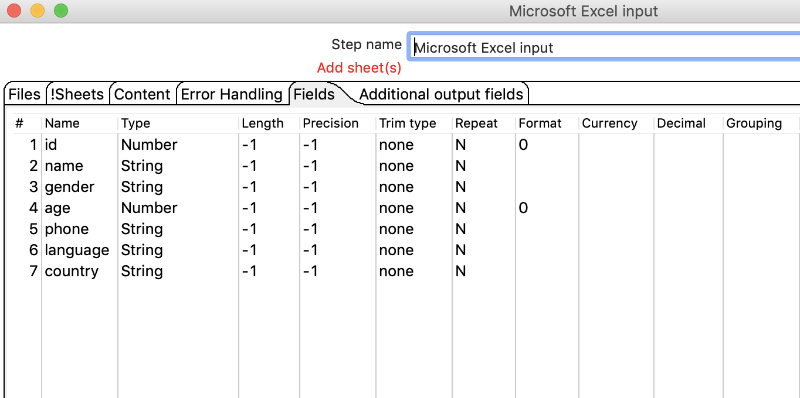
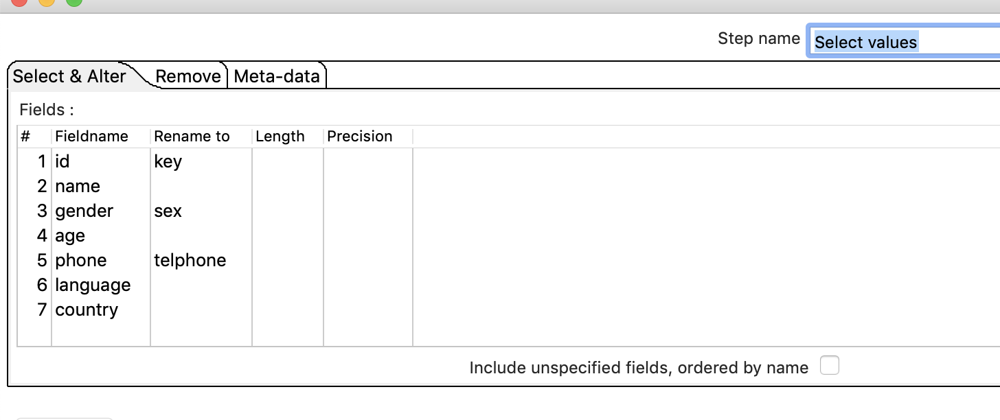
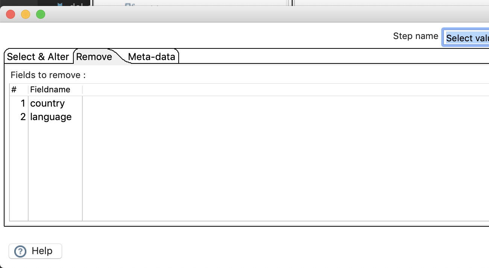
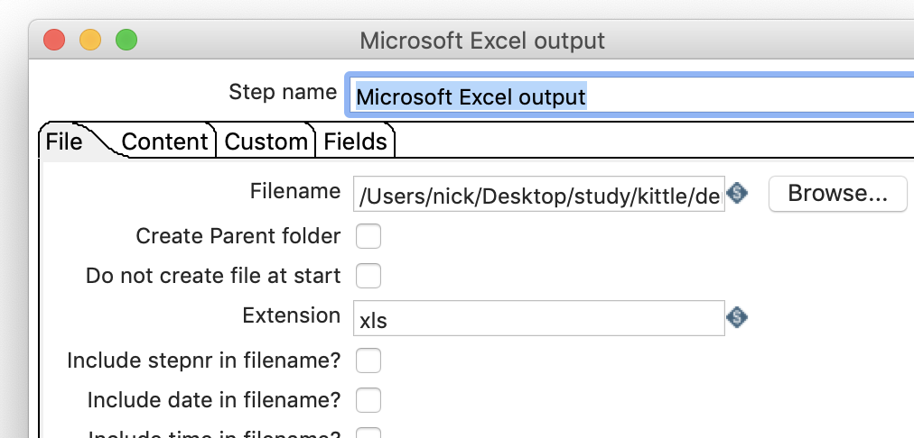
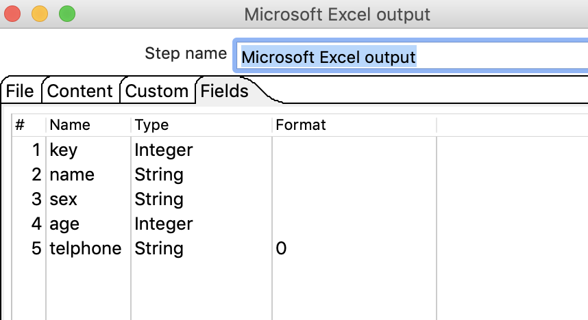
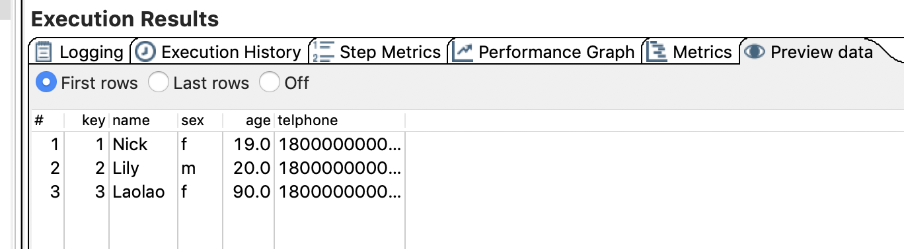

#  字段选择

## 案例介绍

从流中选择字段、改变名称、修改数据类型。

从excel中读取数据，移除languary和country,并把phone改成telphone,id改成key,gender列改成sex。

## 操作步骤

* 输入数据     
  

* 新建转换，拖入excel输入、字段选择、excel输出，并连接  

* 设置excel输入   
  
  

* 设置字段选择  
   

* 设置EXCEL输出  
  
  

* 执行查看效果

> 遗留问题，电话号码多了一个.0,如何解决？
> Excel输入中，telphone的类型选择Number ,格式选择0

