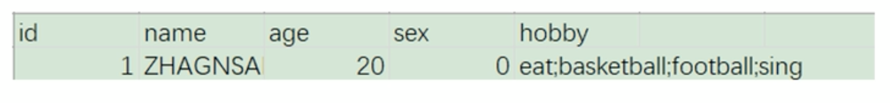
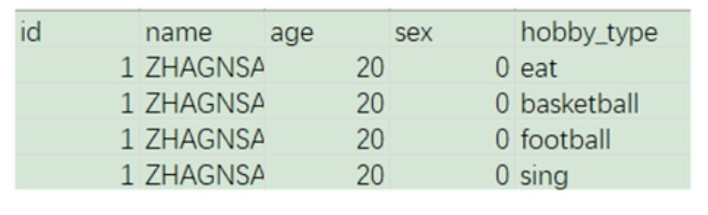
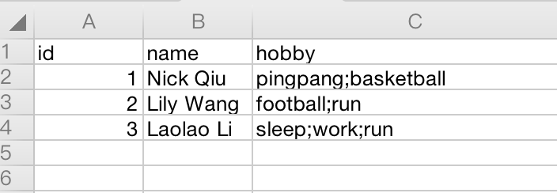
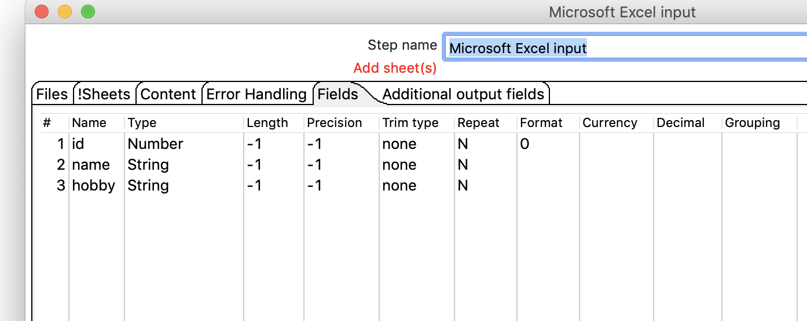
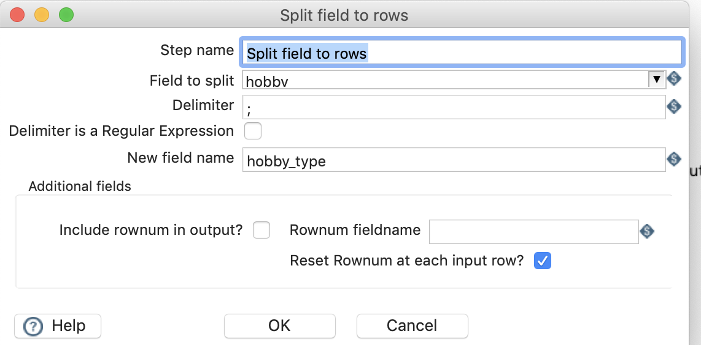
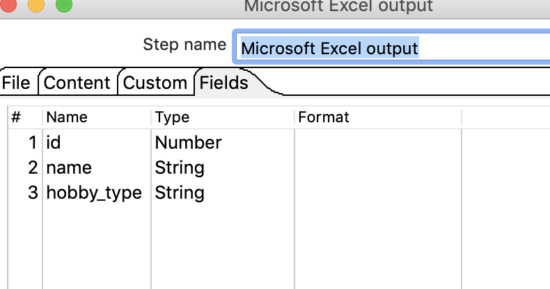
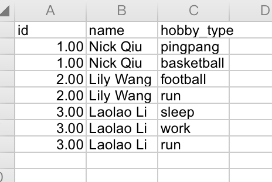

# 列拆分为多行

## 案例说明 

把指定**分隔符**的字段进行拆分为多行

* 处理前如下：    
 

* 处理之后拆分为：     

从excel中读取数据，把hobby列拆分成为多行，并保存到excel中。

## 操作步骤 

* 原始excel 数据   
  

* 新建转换，添加excel输入，列传行，excel输出 ，并连接  
 

* 配置文件输入 

* 配置列转行  
  

* 配置excel输出  
  

* 执行查看效果 

  

