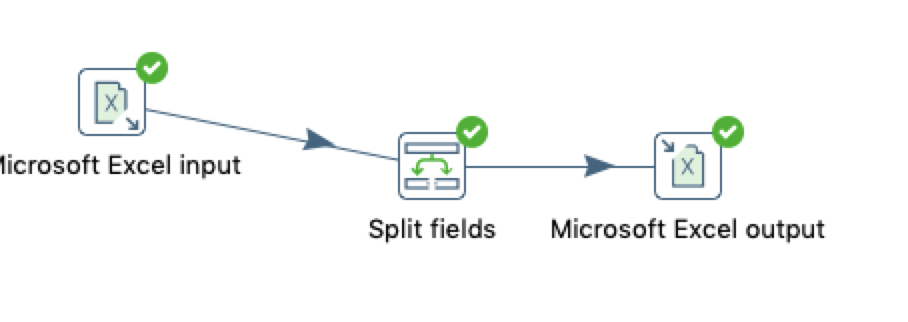

# 拆分字段

## 案例讲解

拆分字段是把字段按**分隔符**拆分成为一个或者是多个字段,拆分之后原数据就不存在流中了。

在excel中把name拆分成为FirstName和LastName并保存到Excel中

## 操作步骤 

* 原始excel 数据   

  

* 新建转换，添加excel输入、拆分字段、excel输出 ，并连接 
  

* excel输入  
 

* 拆分字段  
 

* excel输出  
  

* 执行查看转换结果  

