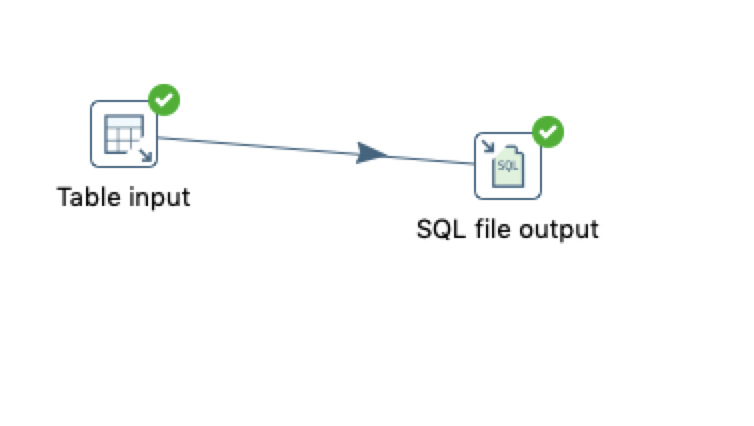
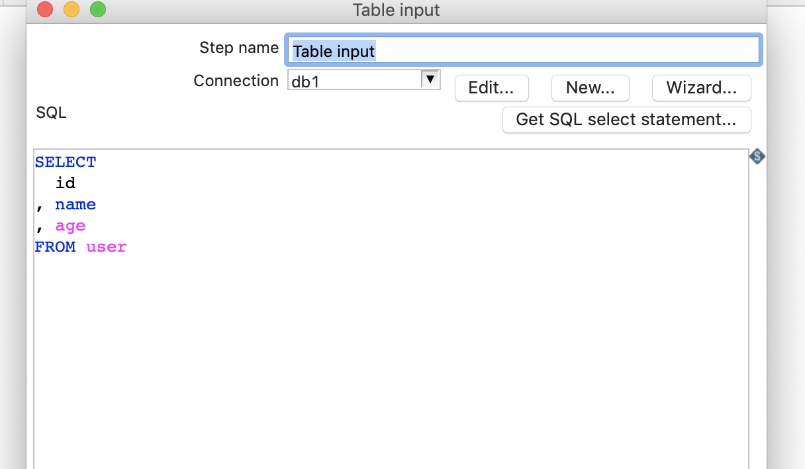
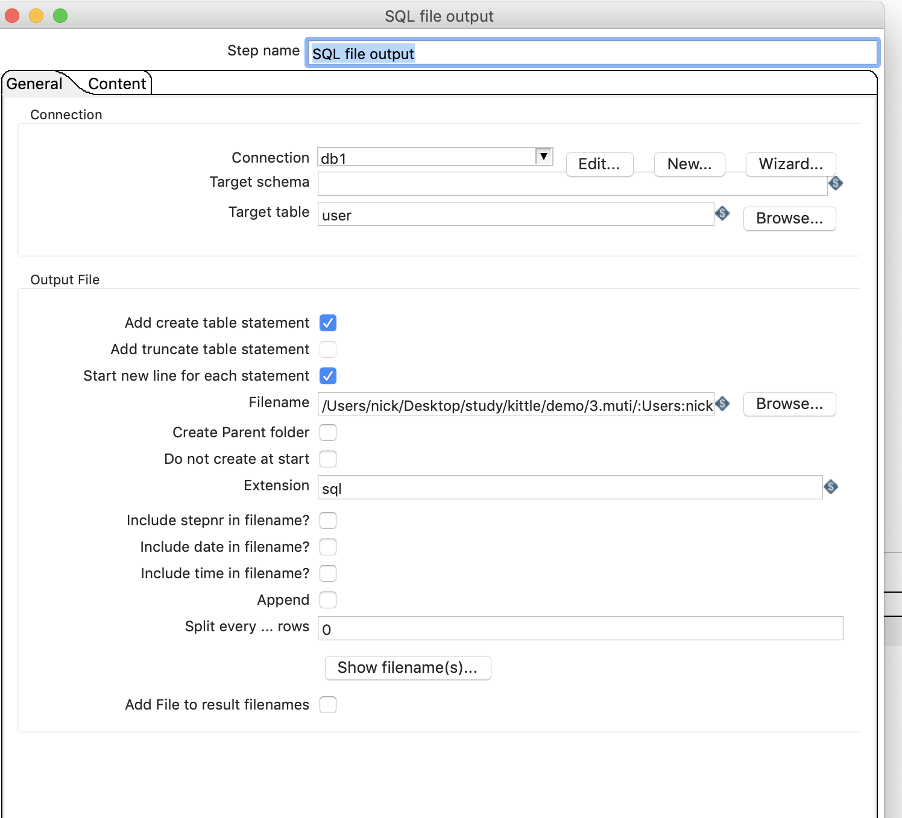
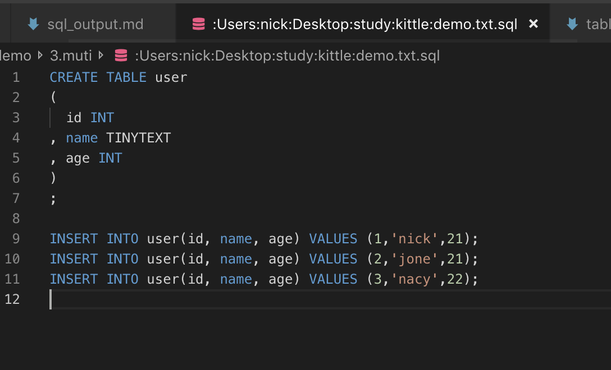

# SQL文件输出

## 案列介绍

从数据库库中获取user表的sql文件。

    ```sql
    DROP TABLE IF EXISTS `user`;

    CREATE TABLE `user`(
        `id` INT(11) NOT NULL AUTO_INCREMENT,
        `name` VARCHAR(20),
        `age` INT(3),
        PRIMARY KEY (`id`)
    );

    INSERT INTO `user` (`name`,`age`) VALUES('nick',21),('jone',21),('nacy',22);
    ```

## 操作步骤

* 控制台内建立表输入和sql输处  



* 表输入  


* sql输出  



* 执行检查结果  





> 遗留问题，primary key 没有了？？？