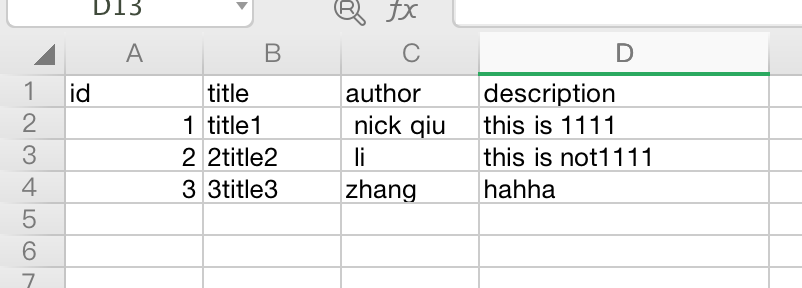
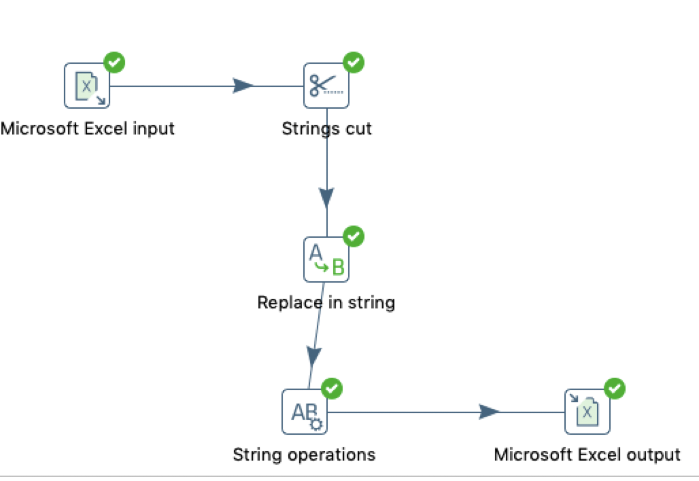
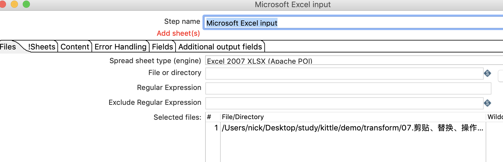
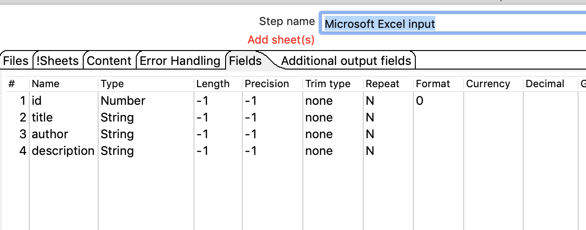
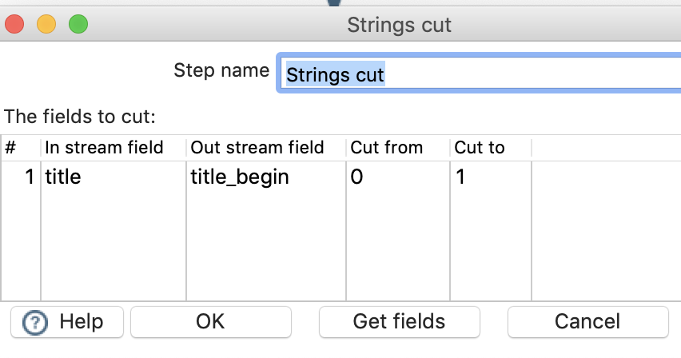
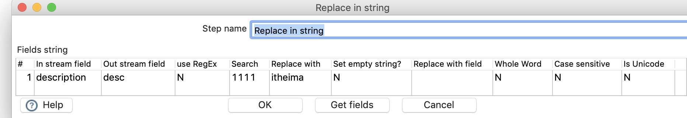
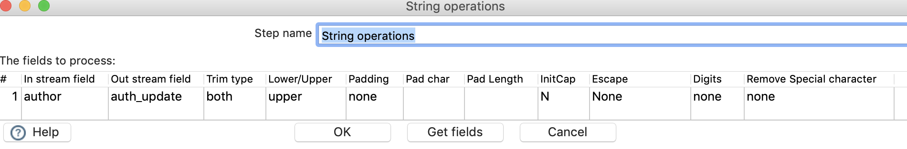
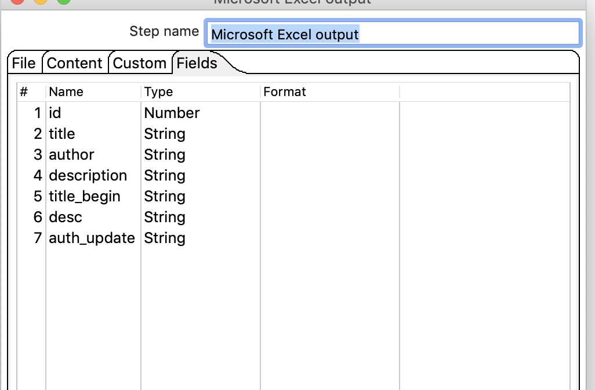
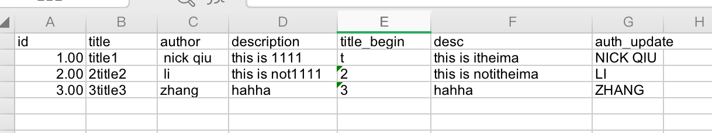

# 字符串剪贴、替换、操作

## 案例介绍

从excel中读取数据，获取title的首位字符，生成title_begin字段，把describption中的1111替换成为itheima生成desc字段，去除author两边的空格，字符串变成大写，生成auth_update,保存到excel

## 操作步骤 

* 原始excel数据  

* 新建转换，添加excel输入、字符串剪贴、字符串替换、字符串操作、EXCEL输出，并连接。

  

* excel输入  
  

* 剪贴（不包含最后一个字符）   

* 字符串替换   

* 字符串操作  

* excel 输出  

 

* 执行查看效果 

