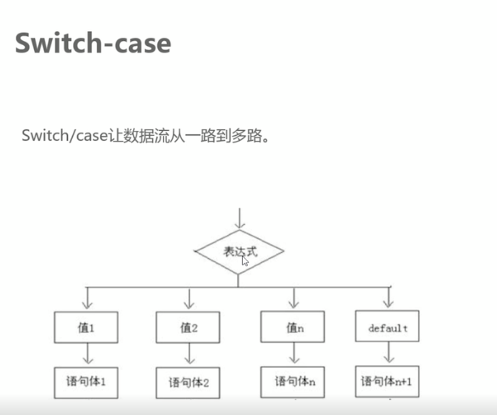
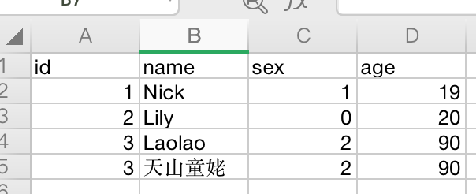
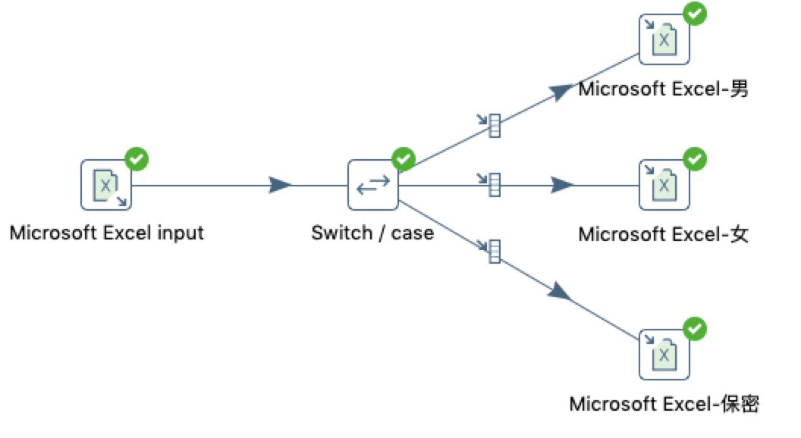
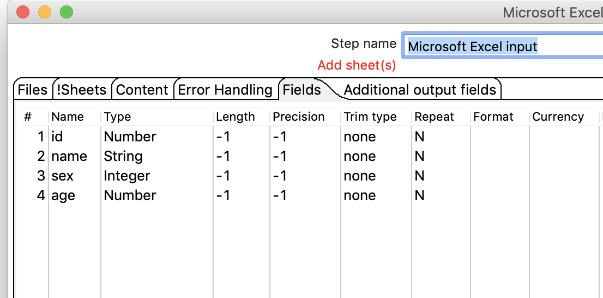
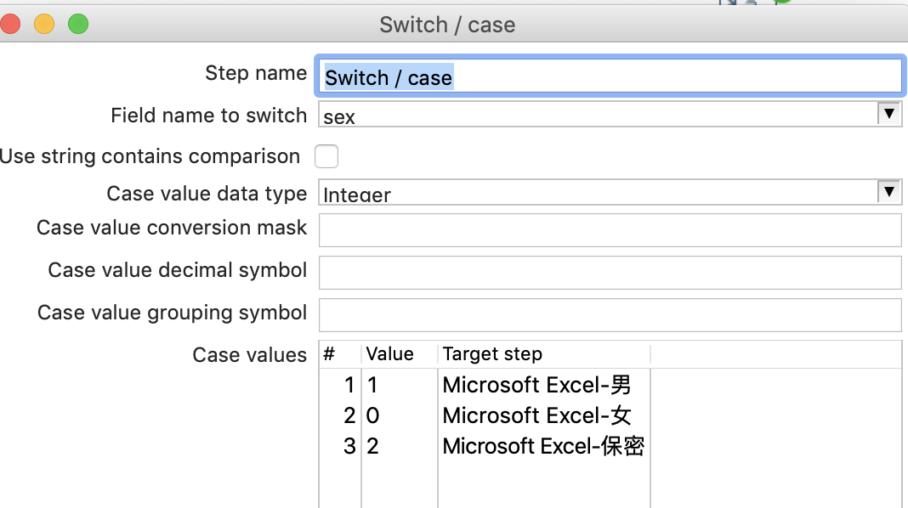
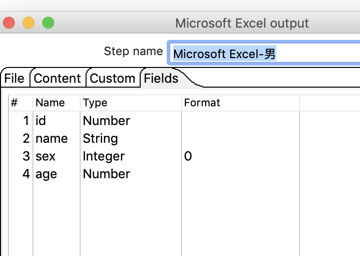
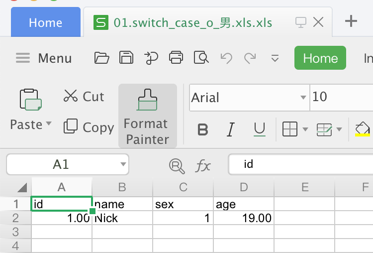
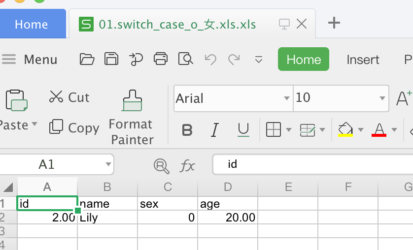
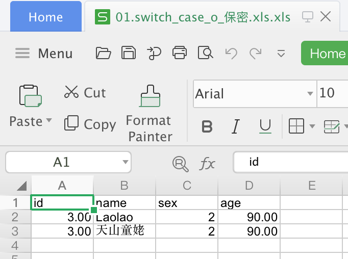

# switch case 

## 案列说明

 

从excel中读取数据，按SEX进行分离数据分类，把女性、男性和保密保存在不同的EXCEL文件中  
* 1表示男性
* 0表示女性
* 2表示保密

## 操作步骤 

* excel输入文件 

* 新建转换，拖入excel输入，switch case，三个excel输处，并连接 

 

* excel 输入 

  

* switch case  
 
 
* 三个excel 输出  
    * Microsoft Excel-男、Microsoft Excel-女、Microsoft Excel-保密  
    

* 执行查看效果  
 

  

  

