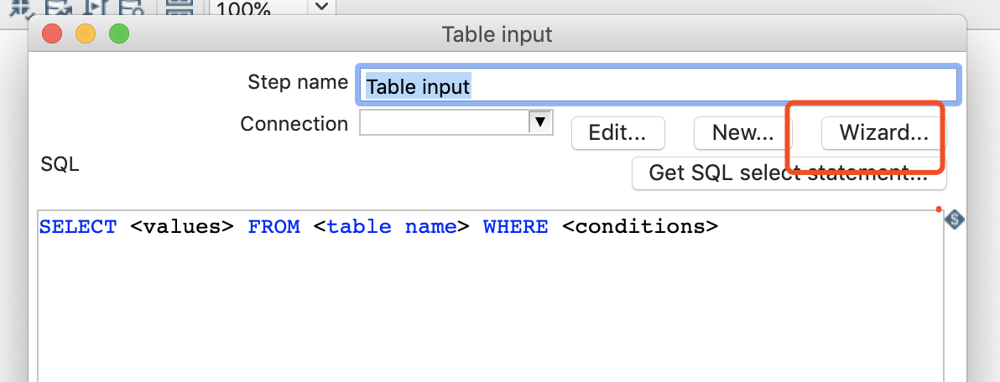

# 表输入(MYSQL)

## 案例介绍

使用Mysql作为数据库中，获取user表中的数据，转存到excel文件中

## 操作步骤


* 准备工作： 
    * 准备驱动（该步骤如果在该电脑上操作过，不需要重复操作），[官网](https://dev.mysql.com/downloads/file/?id=480090)找到mysql驱动包，放到data-integration/lib目录下，重启kettle。
    * 准备MYSQL， 使用使用docker 启动mysql   

    ```bash
    docker run -p 3306:3306 --name mymysql \
        -v $PWD/conf:/etc/mysql/conf.d -v \
        $PWD/logs:/logs -v $PWD/data:/var/lib/mysql \
        -e MYSQL_ROOT_PASSWORD=123456 -d mysql:5.6
    ```  
    *  准备数据库数据  
    ```sql
    DROP TABLE IF EXISTS `user`;

    CREATE TABLE `user`(
        `id` INT(11) NOT NULL AUTO_INCREMENT,
        `name` VARCHAR(20),
        `age` INT(3),
        PRIMARY KEY (`id`)
    );

    INSERT INTO `user` (`name`,`age`) VALUES('nick',21),('jone',21),('nacy',22);
    ```
* 控制台设置TABLE输入，和EXCEL输出  


* 设置数据源

  


* 设置excel 输出

  


* 运行检查结果 

  


