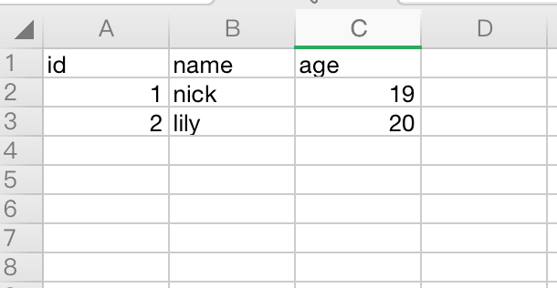
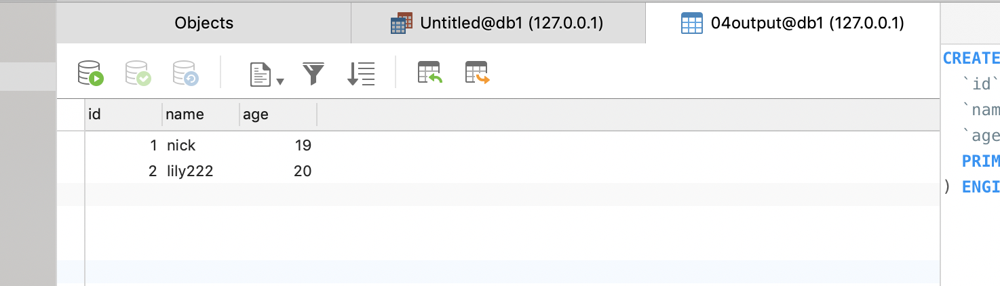
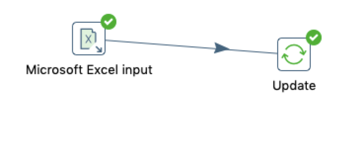
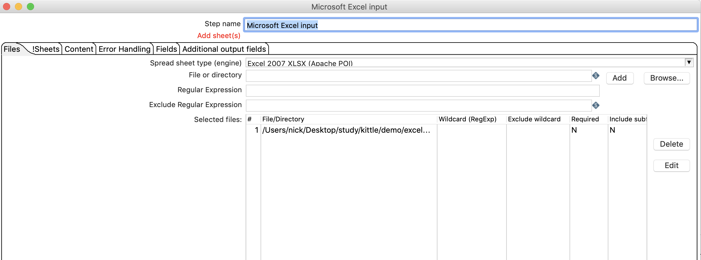
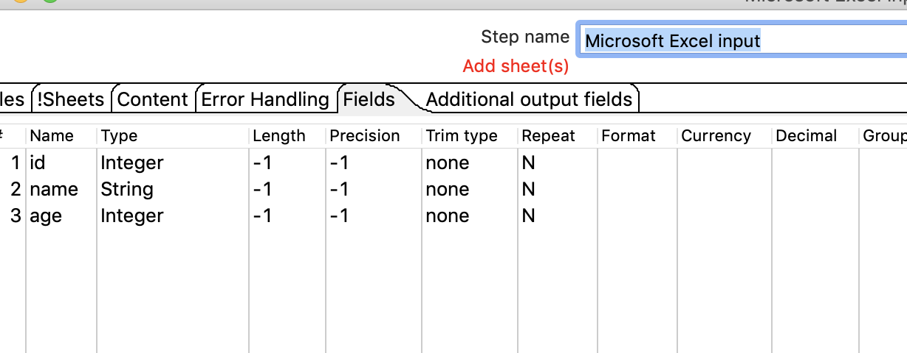
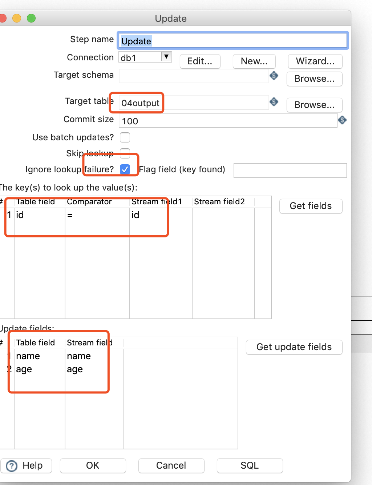
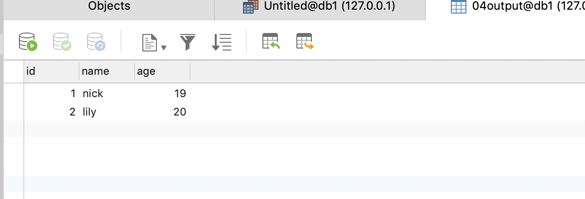

#  更新

## 案列介绍  

把数据流里面的数据和数据库里面的数据进行对比，如果不同就进行更新。

从excel 中读取数据，并把数据更新到数据库中去。

## 操作步骤

* EXCEL数据准备  
 

* MYSQL数据准备  

* 新建转换，加入excel输入，更新，连接 

* 设置EXCEL 输入 

* 设置更新  

* 执行查看效果 ，可以看到mysql中的数据更新成功

