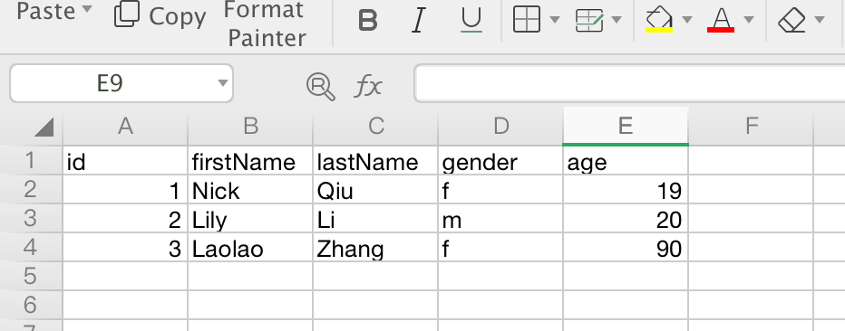
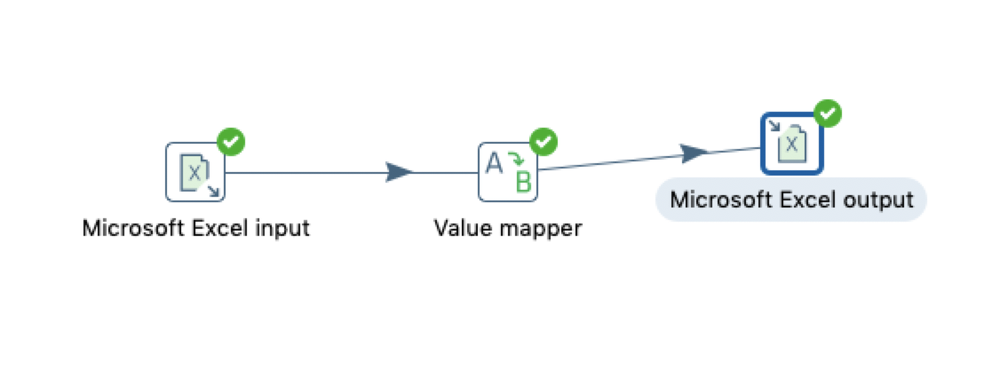
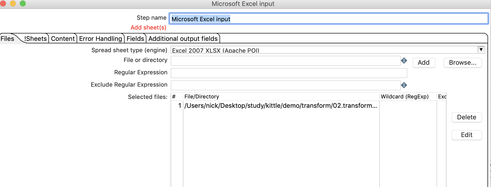
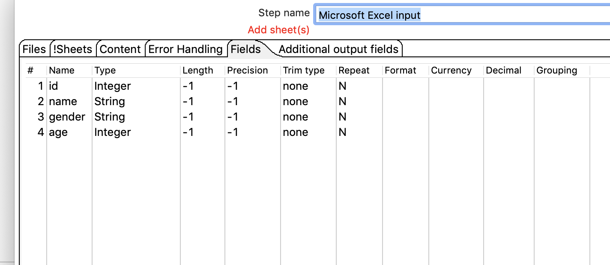
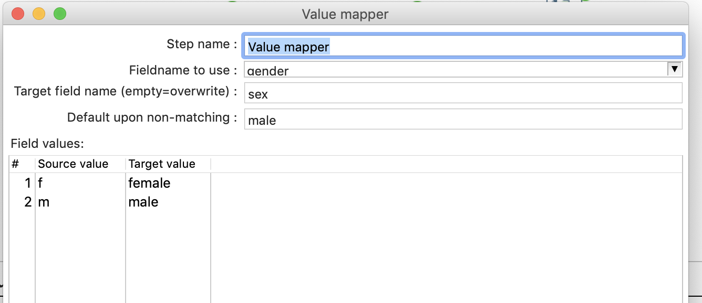
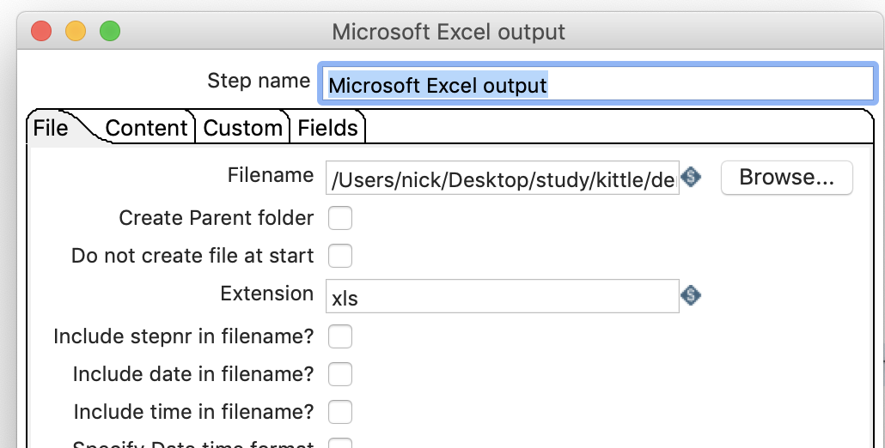
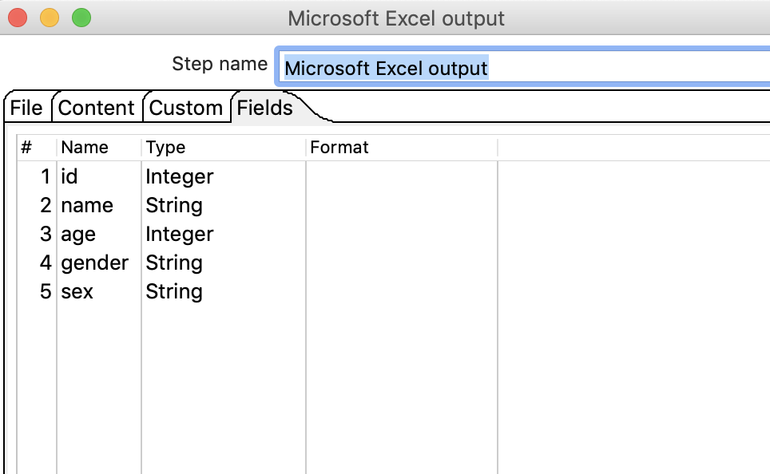
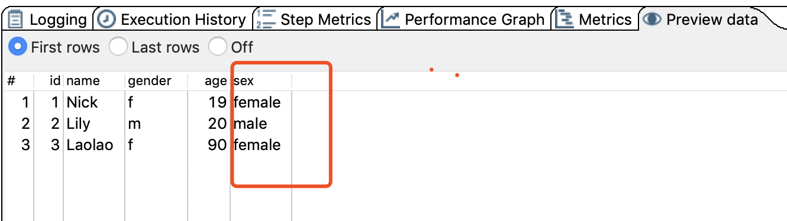

# 值映射 

## 案列介绍

值映射就是把字段中的一个值映射成为其他值。 

* 1-男
* 2-女  

从excel中读取数据，把gender中的f和m转换成为female和male,写入到excel中。

## 操作步骤 

* 输入数据  
  

* 新建转换，添加excel输入，值映射，excel输出，并连接。

* 设置excel输入  
  

* 设置值映射（value mapper）

* 设置excel 输出 
  
  

* 执行查看效果 ，如下添加了一个sex列。 

